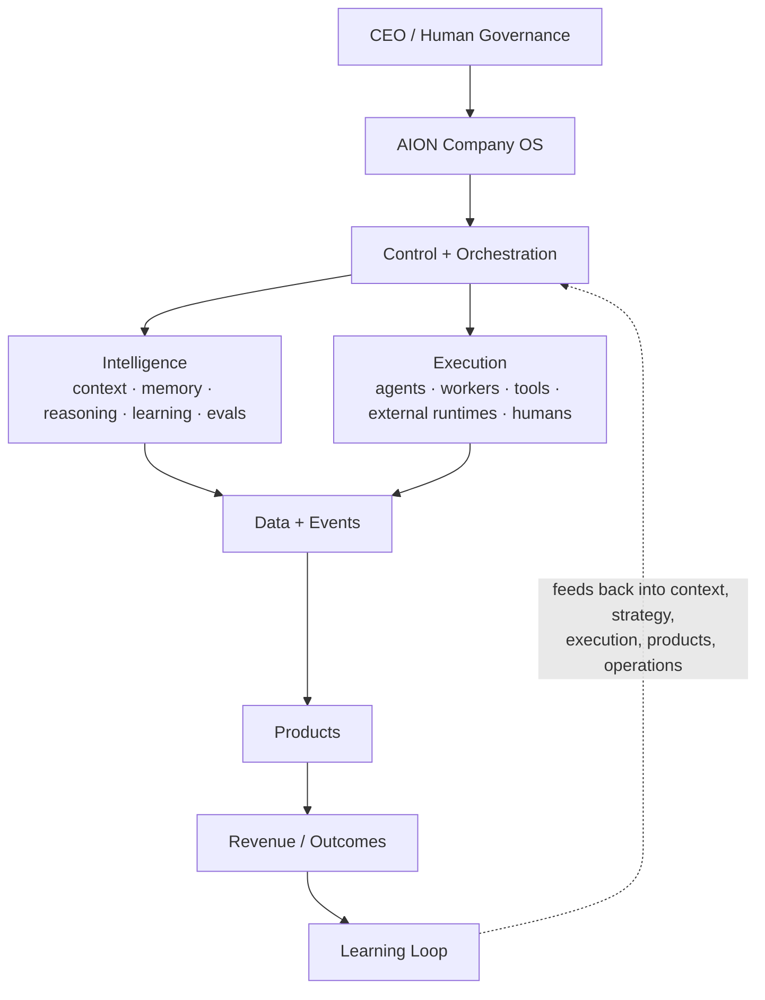

# AION — Architectural Control Plane

> This repository is the **constitution** of the new AION system. It defines
> what AION is, how it is divided, where new code belongs, how work moves
> through the system, what agents may do, and how architectural decisions are
> made — **before** production implementation begins.

`aion-docs` is not a generic documentation repository. It is the authoritative
**architectural and governance source of truth** for the AION ecosystem. It
defines contracts and architecture; it does **not** contain production
application code.

---

## What AION Is

AION is an **AI-native company and product operating architecture** — a
governed system for designing, building, extending, operating, and learning
from products, with humans retaining ultimate authority.

AION is composed of layers:

## What AION Is Not

- **Not one giant autonomous agent.** AION is a governed system of separable
  parts, not a monolithic mind.
- **Not runtime-coupled.** It is not bound to a single model, agent, or vendor.
- **Not a speculative infrastructure project.** Infrastructure is justified by
  active missions, not by imagined future need.
- **Not a place where strategy, orchestration, and execution collapse into one
  process.** Those concerns stay separate by design.
- **Not a single "memory" database.** Operational state, events, memory,
  lessons, recommendations, and analytics are distinct.

See [`architecture/system-overview.md`](architecture/system-overview.md) for
the fuller treatment.

---

## Why This Repository Exists — The Greenfield Reset

Earlier AION work produced valuable experiments, schemas, workflows, and
infrastructure inside the **Aion-Sys** GitHub organization. That work also
accumulated architectural ambiguity: premature infrastructure, overlapping
responsibilities, unclear control-plane boundaries, duplicated concepts,
runtime-specific assumptions, and product logic mixed with platform logic.

The decision — recorded formally in
[**ADR-001: Greenfield Reset**](adr/ADR-001-greenfield-reset.md) — is to leave
the Aion-Sys repositories untouched as historical reference and build a fresh
canonical architecture under the personal `Ceoloo` account.

**Aion-Sys is legacy / reference only.** It is not migrated, copied, imported,
or depended upon. See [`legacy/README.md`](legacy/README.md).

---

## The Six Canonical Repositories

(Five at the greenfield reset; `aion-runtime` added as the sixth by
[ADR-002](adr/ADR-002-runtime-host-ownership.md).)

| Repository | Owns | Does **not** own |
|---|---|---|
| **aion-docs** (this repo) | architecture, principles, governance, terminology, ADRs, ownership rules, standards, mission templates, lifecycle, production-readiness | production application logic |
| **aion-core** | Company OS primitives, orchestration, execution coordination, agent/tool interfaces, workflow engine, permissions/policy, execution event contracts, observability hooks, shared packages | databases, product UI, infra, department workflows |
| **aion-data** | canonical schemas, migrations, event persistence, memory models, outcome & learning records, analytics contracts, data governance, lineage | orchestration, product UI, infra |
| **aion-runtime** | the composition root that boots Core+Data into a running, health-checked service; the migration entrypoint; the one provider-neutral deployable image | orchestration policy, canonical schema, provider SDKs, product logic |
| **aion-infra** | cloud infra, environments, IaC, networking, secrets architecture, monitoring/security infra, CI/CD infra, environment isolation | business logic, product logic |
| **aion-products** | customer-facing & internal products, product seeds, mission-gated experiments, interfaces built on core + canonical data | platform primitives, infra, canonical data ownership |

Full boundaries and dependency rules: [`repositories/`](repositories/README.md).

---

## Architecture Navigation

- **[architecture/](architecture/README.md)** — system model, layers, control
  plane, execution, intelligence, data, products, learning, observability,
  security, environments.
- **[repositories/](repositories/README.md)** — per-repo responsibility and the
  dependency rules that prevent architectural drift.
- **[governance/](governance/README.md)** — authority model, human gates, agent
  governance, permissions, risk levels, change management.
- **[engineering/](engineering/README.md)** — principles, production readiness,
  testing, evals, observability/API/event standards, data contracts,
  definition of done.
- **[missions/](missions/README.md)** — the mission lifecycle and templates
  through which products are built.
- **[adr/](adr/README.md)** — architecture decision records and their standard.
- **[roadmap/](roadmap/README.md)** — build order and platform maturity model.
- **[research/](research/README.md)** — dated external-research briefs and the
  ADRs, architecture, and design specs they drive.
- **[glossary/](glossary/README.md)** — canonical terminology.
- **[legacy/](legacy/README.md)** — policy on Aion-Sys reference material.

---

## Current Maturity

AION is at **L0 — Documented**: architecture and contracts exist; no production
code has been built. Maximum autonomy is **not** the goal — reliable business
outcomes under appropriate governance is. See
[`roadmap/platform-maturity.md`](roadmap/platform-maturity.md).

The build order begins here (Phase 0) and proceeds to `aion-core`. See
[`roadmap/build-order.md`](roadmap/build-order.md).

---

## How Engineering Decisions Are Made

1. **Missions drive work.** Nothing significant is built without a mission that
   states the problem, user, outcome, scope, and non-goals. See
   [`missions/lifecycle.md`](missions/lifecycle.md).
2. **Architectural choices are recorded as ADRs.** Reversible details need no
   ADR; anything that shapes boundaries, ownership, or cross-repo contracts
   does. See [`adr/README.md`](adr/README.md).
3. **Boundaries are enforced.** Where new code belongs is decided by the
   repository ownership rules, not by convenience. See
   [`repositories/dependency-rules.md`](repositories/dependency-rules.md).
4. **Principles are binding.** See
   [`engineering/principles.md`](engineering/principles.md).

---

## Reading Order for a New Engineer (or Agent)

1. This README.
2. [`architecture/system-overview.md`](architecture/system-overview.md)
3. [`engineering/principles.md`](engineering/principles.md)
4. [`repositories/dependency-rules.md`](repositories/dependency-rules.md)
5. [`governance/authority-model.md`](governance/authority-model.md)
6. [`missions/lifecycle.md`](missions/lifecycle.md)
7. [`roadmap/build-order.md`](roadmap/build-order.md)
8. [`adr/ADR-001-greenfield-reset.md`](adr/ADR-001-greenfield-reset.md)
