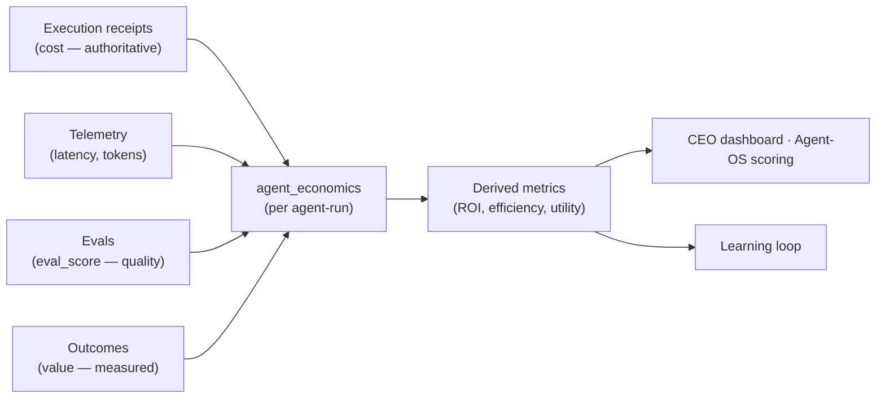

# Agent Economics

AION's observability spine records what an action cost; the
[learning loop](learning-loop.md) records what it achieved. **Agent Economics**
is the layer that composes the two into the question that actually matters:
*was this autonomous work worth its cost?*

This is the architectural model; the decision is
[ADR-004](../adr/ADR-004-agent-economics-layer.md), motivated by the
[2026 Runtime-Control Brief](../research/2026-runtime-control-brief.md) (signal
3). Concrete storage is designed in
[`aion-data/docs/design/economics-and-idempotency.md`]; product consumption in
[`aion-products/docs/design/agent-economics-consumption.md`].

## From token count to business value

The field is moving from `trace → token count` to
`trace → quality → cost → business value`. AION's economics layer follows that
arc, with honest trust levels at each step:



## The economics record

Per agent-run, composed — never self-reported:

```
agent_run
├── mission_id
├── agent_id
├── runtime                 ← which execution environment
├── model
├── tokens                  ← from telemetry
├── compute_cost            ← from receipts (authoritative)
├── tool_cost               ← from receipts (authoritative)
├── latency                 ← from telemetry
├── task_result             ← success / failure
├── eval_score              ← quality (from evals)
├── human_minutes_saved     ← measured (from outcomes)
├── revenue_influenced      ← attributed (method + confidence recorded)
├── revenue_created         ← measured (from outcomes)
└── roi                     ← derived, not stored as measured
```

## Trust levels are not negotiable

Every number carries where it came from, because mixing them corrupts the
[learning loop](learning-loop.md):

| Family | Trust | Source |
|---|---|---|
| **Cost** (`compute_cost`, `tool_cost`, `tokens`) | **authoritative** | execution receipts, telemetry |
| **Quality** (`eval_score`, `task_result`) | **measured** | evals, run result |
| **Realized value** (`human_minutes_saved`, `revenue_created`) | **measured** | outcomes |
| **Attributed value** (`revenue_influenced`) | **estimated** | attribution model — method + confidence recorded |
| **ROI / efficiency / utility** | **derived** | computed from the above |

- **Cost is authoritative; value is measured; ROI is derived.** Estimated value
  never overwrites measured cost.
- **No worker writes its own economics row.** Economics is computed *about* runs,
  by the data layer, from evidence — never by the agent whose ROI it describes.

## Canonical derived metrics

Defined once, in aion-data, consumed everywhere (dependency rules #4/#5):

| Metric | Definition | Reads |
|---|---|---|
| **Cost per successful task** | `total_agent_cost / successful_tasks` | "is autonomy cheap?" |
| **Automation efficiency** | `human_time_saved / agent_cost` | "does it save more than it costs?" |
| **Revenue ROI** | `revenue_attributed / agent_cost` | "does it make more than it costs?" |
| **Agent utility** | `successful_outcomes × quality / total_cost` | Agent-OS performance score |

## Vendor neutrality

`compute_cost` and `tool_cost` are captured in AION's abstract cost units at
execution time (as AION Core already does), and priced through one owned,
versioned unit→currency contract in the economics layer. Switching model vendors
or renegotiating tool pricing re-prices history through that contract — not a
schema change and not a rewrite of stored runs.

## Economics as product

The [system overview](system-overview.md) defines the AION Agent OS as the
control plane that determines what autonomous intelligence can do, executes it
safely, measures whether it worked, **calculates whether it was worth the cost**,
and learns from the outcome. Economics is that fourth clause made real. It is
therefore a candidate *product* surface, not merely internal monitoring —
consumed by products through the canonical contract, never forked.

## Phasing

Economics is meaningful only once cost evidence
([execution receipts](execution-gateway.md), ADR-003) and real
[outcomes](learning-loop.md) exist. It aligns with
[build order](../roadmap/build-order.md) Phase 5 (outcome instrumentation) and
Phase 6 (learning). Before then it is partial and labeled as such; no live ROI is
built ahead of real outcomes to measure.

## Invariants

- **Cost is authoritative, value is measured, ROI is derived — never blended
  away.**
- **One canonical economics contract, owned by aion-data; consumers read, never
  fork.**
- **No agent reports its own economics.**
- **Attributed value carries its attribution method and confidence.**
