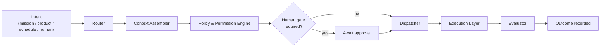

# Control Plane (Orchestration)

The control plane is the **decision layer** of AION. It decides *what* needs to
happen; execution decides nothing and simply *does the work*. This separation is
a load-bearing invariant — see
[principles: Orchestration Is Not Execution](../engineering/principles.md).

Home repository: **aion-core**.

## What the control plane decides

For any unit of work, the orchestration layer decides:

- **What needs to happen** — the goal, decomposed into steps.
- **Which capability should handle it** — routing to an execution environment.
- **What context is required** — assembled from the intelligence layer.
- **What policies apply** — permissions, data scope, risk level.
- **Whether human approval is necessary** — inserting a gate if policy requires.
- **How success is evaluated** — the criteria checked against the outcome.

The control plane does **not** perform the work itself, hold canonical data, or
render product UI.

## Components

| Component | Responsibility |
|---|---|
| **Router** | Classifies intent and selects a capability/execution environment. |
| **Context Assembler** | Pulls the minimum required context (memory, state, lessons) and passes a **reference**, not a dump. |
| **Policy & Permission Engine** | Applies [permissions](../governance/permissions.md) and determines [risk level](../governance/risk-levels.md). |
| **Human Gate Manager** | Pauses work for approval when policy requires. See [human-gates.md](../governance/human-gates.md). |
| **Dispatcher** | Hands work to the chosen execution environment via the common execution contract. |
| **Evaluator** | Compares the outcome against the success criteria set at dispatch. |

## Contracts the control plane owns (at architectural level)

- **Work / run contract** — the identity and shape of a unit of dispatched work
  (`run_id`, `mission_id`, `workflow_id`, context reference, risk level).
- **Execution contract** — the common input/output interface every execution
  environment implements. See [execution-layer.md](execution-layer.md).
- **Policy contract** — how permissions and gates are expressed and evaluated.
- **Evaluation contract** — how success criteria are declared and checked.

These are defined here architecturally and implemented in `aion-core`. Concrete
schemas live in `aion-data`; wire/event contracts are documented in
[../engineering/event-standards.md](../engineering/event-standards.md).

## Scope discipline

`aion-core` coordinates systems. It must **not** become:

- the database (that is `aion-data`),
- product UI (that is `aion-products`),
- the infrastructure repository (that is `aion-infra`),
- a CRM or any department-specific workflow.

See [../repositories/aion-core.md](../repositories/aion-core.md) for the full
boundary and [../repositories/dependency-rules.md](../repositories/dependency-rules.md).

## Invariants

- **The orchestrator never executes.** If it starts "just doing" the work, the
  seam has broken.
- **Every dispatch carries identity, context reference, policy, and success
  criteria.** No anonymous work.
- **Human gates are decided by policy, not by the executing worker.**
- **Routing is capability-based, not runtime-hardcoded.** Adding a new agent
  runtime must not require rewriting orchestration logic.
