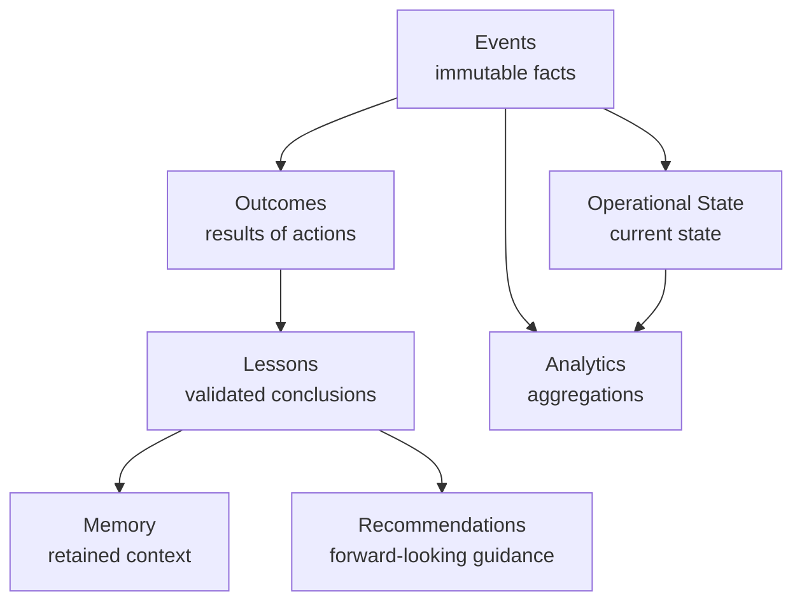

# Data Layer (Data + Events)

The data layer is AION's **system of record**. It holds canonical schemas,
immutable events, and the derived stores that power operations, learning, and
analytics. Home repository: **aion-data**.

The governing rule: **data ownership is explicit.** Every business entity,
schema, and event has exactly one canonical owner. No repository invents its own
version of a canonical entity.

## The six data kinds (do not collapse them)

| Kind | Definition | Mutability |
|---|---|---|
| **Operational state** | Current business/system state (the "now"). | Mutable, but every change is driven by an event. |
| **Events** | Immutable facts representing what happened. | Append-only. Never edited. |
| **Memory** | Useful retained context for future work. | Updated as lessons accrue. |
| **Lessons** | Validated conclusions derived from real outcomes. | Added; superseded, not silently rewritten. |
| **Recommendations** | Forward-looking guidance derived from lessons. | Revised as lessons change. |
| **Analytics** | Aggregations used for decision-making. | Derived; recomputable from events. |

These must **not** collapse into one generic "memory" database. Collapsing them
destroys lineage and makes learning untrustworthy.

## Events represent what happened

Events describe **completed facts** in past tense. Commands and intentions must
**not** be disguised as events. This is a hard standard — see
[../engineering/event-standards.md](../engineering/event-standards.md).

| Good (facts) | Avoid (commands) |
|---|---|
| `lead.created` | `send.proposal` |
| `call.completed` | `do.outreach` |
| `proposal.sent` | |
| `payment.received` | |
| `deployment.failed` | |

## Ownership and lineage

- **One canonical owner per entity.** The owner defines the schema, the write
  path, and the events. Everyone else reads. See
  [../governance/authority-model.md](../governance/authority-model.md) for the
  ownership model and [../repositories/dependency-rules.md](../repositories/dependency-rules.md)
  for enforcement.
- **Lineage is traceable.** Every derived record (state, outcome, lesson,
  analytic) can be traced back to the events it came from.
- **No shadow canonical entities.** Products and services may cache or project
  data, but the canonical definition lives once, in `aion-data`.

## What aion-data owns

canonical schemas · migrations · event persistence · memory models · outcome
records · learning records · analytics contracts · data governance · database
access patterns · durable business context · data lineage.

See [../repositories/aion-data.md](../repositories/aion-data.md).

## Deferred technology choices

Concrete storage engines, event brokers, and analytics stores are **not** fixed
here. The **required capability** is documented (e.g. "durable append-only event
storage"; "durable asynchronous event delivery once throughput/reliability
justify a broker") and the implementation is selected via an ADR when the
requirement is real. See [../adr/README.md](../adr/README.md).

## Invariants

- **Explicit ownership; no duplicate sources of truth.**
- **Events are append-only, past-tense facts.**
- **Derived stores are recomputable from events.**
- **The six data kinds stay distinct.**
