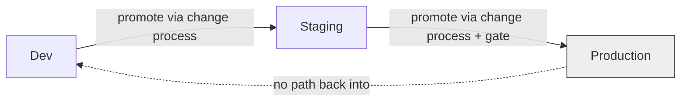

# Environments

AION separates environments so that work, data, and identities are isolated by
stage, and so that promotion to production is deliberate and governed.

Environment **infrastructure** is owned by `aion-infra`; this document defines
the **architectural expectations** environments must satisfy.

## Environment tiers

| Tier | Purpose | Data | Human gate to promote out |
|---|---|---|---|
| **Local / Dev** | Individual development and experimentation. | Synthetic / non-sensitive. | — |
| **Staging** | Integration and pre-production validation. | Non-production or masked. | Required per change process. |
| **Production** | Real customers, real outcomes. | Canonical, sensitive. | Required where policy demands. See [../governance/human-gates.md](../governance/human-gates.md). |

The exact set and names are finalized by `aion-infra` via an ADR; the invariants
below hold regardless.

## Isolation requirements

- **No cross-tier reach.** A lower environment must not be able to read or write
  a higher environment's canonical data or secrets.
- **Separate identities and secrets per environment.** Credentials are never
  shared across tiers. See [security-model.md](security-model.md).
- **Production data does not flow downward** except through an explicit,
  governed, and masked path.
- **Promotion is a governed change**, not a file copy. See
  [../governance/change-management.md](../governance/change-management.md).

## Relationship to other layers

- **Security** — environment isolation is part of the least-privilege model.
- **Observability** — traces carry enough context to know which environment an
  action ran in.
- **Data** — canonical data lives in production; lower tiers use synthetic or
  masked data.

## Deferred choices

Cloud provider, environment topology, and networking specifics are **not** fixed
here. The required capability — **isolated, separately-credentialed environments
with governed promotion** — is documented; the implementation is selected by
`aion-infra` through an ADR when a mission requires it. Infrastructure supports
the architecture; it does not dictate it.

## Invariants

- **Environments are isolated by identity, secret, and data.**
- **Promotion is deliberate and governed.**
- **Production is the only home of canonical, sensitive data.**
