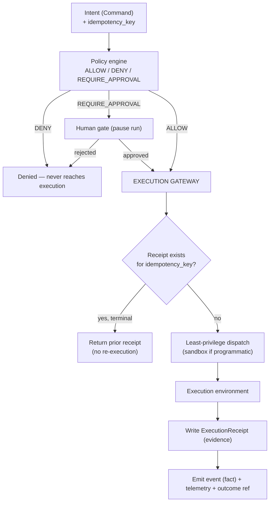

# Execution Gateway

The [execution layer](execution-layer.md) *performs* work; the
[control plane](control-plane.md) *decides* on it. The **Execution Gateway** is
the seam between them — the single boundary every state-changing execution passes
through, where a policy-cleared intent becomes a governed, at-most-once,
evidenced side effect.

It is **not a new service or a new subsystem.** It is the hardened contract seam
already implied by the orchestrator: policy clearance, least-privilege
identity, sandboxing, idempotency, and evidence, applied *before and around* the
adapter call. Naming it makes explicit where those guarantees live — and where
their absence is a defect.

This document is the architectural model. Concrete contracts are designed in
[`aion-core/docs/design/execution-gateway.md`]; durability in
[`aion-data/docs/design/economics-and-idempotency.md`]; composition in
[`aion-runtime/docs/design/execution-gateway-composition.md`]. The decision is
[ADR-003](../adr/ADR-003-execution-gateway-and-evidence.md), motivated by the
[2026 Runtime-Control Brief](../research/2026-runtime-control-brief.md).

## The execution contract, extended

AION's governed execution chain is:

```
Agent → Intent → Policy → Approval → Execution → Evidence → State commit
```

Every state-changing tool call carries the fields that make each link
enforceable and auditable:

| Field | Set by | Purpose |
|---|---|---|
| `run_id` / `agent_id` | control plane | trace anchor + attributable identity |
| `capability` / `tool_id` | intent | what verb, which tool |
| `arguments_hash` | gateway | canonical fingerprint of what actually executes |
| `risk_class` | policy engine (central) | drives autonomy tier & gating |
| `approval_state` | gate | not_required / pending / approved / rejected |
| `idempotency_key` | caller or derived | at-most-once guarantee scope |
| `execution_result` | adapter | normalized result (success/failure) |
| `cost` | gateway (from adapter + tool) | compute + tool cost, for economics |

## What the gateway guarantees



1. **Denied actions never reach an adapter.** (Existing invariant, restated: the
   gateway is where it is enforced.)
2. **At-most-once per idempotency key.** A second attempt for a key with a
   terminal receipt returns that receipt instead of re-running the side effect.
   This holds across **retries** and **run resumes**, not just within one call.
3. **Key reuse with different arguments is a conflict, not a replay.** The
   `arguments_hash` distinguishes a safe retry of the same action from a
   different action wearing a reused key; a conflict fails safe.
4. **Every side effect leaves evidence.** A durable, append-only
   `ExecutionReceipt` records what ran, under which approval, at what cost — the
   source of truth for audit and [economics](agent-economics.md).
5. **Least privilege at dispatch.** The environment receives only the tools and
   data the work declared ([security-model](security-model.md)); programmatic
   plans run [sandboxed](execution-layer.md).

## Replay safety spans the run

The dangerous case is not one call — it is a **resumed** run. AION Core already
resumes the *same* run after a gate (`awaiting_approval → approved`). Resumable
and retried runs are exactly where a worker can repeat a side effect. The gateway
therefore re-enters the idempotency check on **every** dispatch, including
resume and retry, and never re-executes a step whose receipt is terminal. A
resumed Grok, Atlas, Cursor, or future AION worker cannot unknowingly send,
charge, or deploy twice.

## What the gateway is *not*

- **Not orchestration.** It decides nothing about routing or which mission runs;
  it enforces guarantees on an already-decided execution.
- **Not a tool implementation.** It does not know how to send an email; it
  ensures the send happens at-most-once and is evidenced.
- **Not vendor-specific.** No adapter is trusted to self-enforce idempotency or
  write its own receipt. The guarantee lives at the AION boundary so swapping
  runtimes is a config change ([execution-layer](execution-layer.md) rule #1).

## Relationship to the ledger

Three distinct records, linked by shared IDs, never conflated:

| Record | Answers | Owner |
|---|---|---|
| **Event** ([event-standards](../engineering/event-standards.md)) | *What business fact happened?* (`proposal.sent`) | aion-data |
| **Execution receipt** (this doc, ADR-003) | *Did this governed side effect run, at-most-once, at what cost?* | aion-data |
| **Outcome** ([learning-loop](learning-loop.md)) | *What real-world consequence resulted?* (`customer paid`) | aion-data |

## Invariants

- **Every state-changing execution passes through the gateway; there is no side
  door.** (Dependency rule #5: products reach the platform through contracts,
  never around it.)
- **At-most-once per idempotency key, across retries and resumes.**
- **Every side effect leaves an append-only receipt.**
- **Idempotency, hashing, and evidence are enforced centrally, never by the
  executing worker.**
