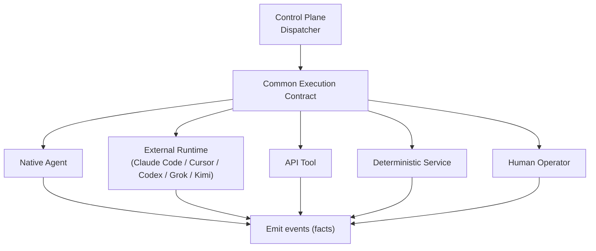

# Execution Layer

The execution layer **performs the work** the control plane decides on. It makes
no orchestration decisions: it receives a well-formed unit of work, does it, and
emits facts.

Interfaces are owned by **aion-core**; the environments themselves are a mix of
native code (`aion-products`, `aion-core` services), external runtimes, and
humans.

## Execution environments

AION must **not** be coupled to one model or agent runtime. Execution
environments are interchangeable behind a common contract:

| Environment | Examples |
|---|---|
| **Native AION agents** | Governed workers implemented in-platform. |
| **External agent runtimes** | Claude Code, Cursor agents, Codex, Grok, Kimi/OpenClaw. |
| **API tools** | Third-party and internal APIs invoked as tools. |
| **Deterministic services** | Plain code paths with no model in the loop. |
| **Human operators** | People executing routed work. A first-class environment. |

## The common execution contract

Every environment, human included, is invoked through one contract so the
control plane never special-cases a runtime:

- **Input contract** — goal, context reference, allowed tools, allowed data,
  constraints, risk level, success criteria.
- **Output contract** — result payload, emitted events, cost/usage, status,
  and (on failure) a structured error.
- **Observability** — every invocation is traceable per
  [observability.md](observability.md).

Agents specifically are **governed workers**, not free-roaming personalities.
Each has an explicit specification — see
[agent-governance.md](../governance/agent-governance.md).

## Coupling rules

1. **No AION logic assumes a specific runtime or model.** Swapping Claude Code
   for another agent must be a routing/config change, not a rewrite.
2. **External runtimes get least-privilege identities.** They receive only the
   tools and data the work requires. See [security-model.md](security-model.md).
3. **Humans are execution, not exceptions.** Work routed to a person flows
   through the same contract and is observable the same way.
4. **Execution emits events; it does not mutate canonical truth directly.**
   Effects on business entities happen through the data layer's owned write
   paths, and the fact of what happened is emitted as an event.

## Invariants

- **Execution decides nothing about policy, routing, or gates.**
- **Every worker declares the tools and data it needs; it gets no more.**
- **A failed execution is a first-class, observable outcome** — `deployment.failed`
  is as real a fact as `deployment.succeeded`.
