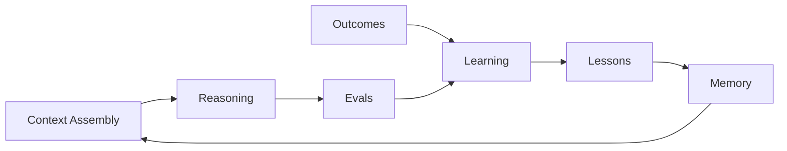

# Intelligence Layer

The intelligence layer supplies the reasoning inputs and quality signals the
rest of AION depends on: **context, memory, reasoning, learning, and evals**. It
serves the control plane (for decisions) and execution (for doing work well).

Interfaces are owned by **aion-core**; durable records (memory, lessons,
outcomes, eval results) are owned by **aion-data**.

## Components

| Component | Responsibility | Owner |
|---|---|---|
| **Context assembly** | Gather the minimum relevant context for a unit of work and expose it by reference. | aion-core (assembly) / aion-data (sources) |
| **Memory** | Useful retained context, retrievable and scoped. | aion-data |
| **Reasoning** | Model-driven inference invoked as a governed capability. | aion-core (interface) / model providers |
| **Learning** | Derive validated lessons from real outcomes. | aion-core (loop) / aion-data (records) |
| **Evals** | Measure quality of decisions, outputs, and workflows. | aion-core (harness) / aion-data (results) |

## Memory is not one thing

A recurring failure mode is collapsing everything into a single generic
"memory" store. AION keeps these **distinct** (full definitions in
[data-layer.md](data-layer.md)):

- **Operational state** — current business/system state.
- **Events** — immutable facts of what happened.
- **Memory** — useful retained context.
- **Lessons** — validated conclusions derived from outcomes.
- **Recommendations** — forward-looking guidance.
- **Analytics** — aggregations used for decision-making.

Memory is fed by lessons; lessons are derived from outcomes; outcomes are
derived from events. See [learning-loop.md](learning-loop.md).

## Reasoning as a governed capability

- Reasoning (model inference) is invoked through the execution contract like any
  other capability — with identity, permissions, cost controls, and
  observability.
- **No model coupling.** The intelligence layer names the *capability*
  ("summarize", "classify", "reason over context"), not a fixed vendor. Model
  selection is a routing/config concern, deferred to an ADR where it must be
  standardized.

## Evals

- Evals measure the quality of decisions and outputs, not merely whether code
  ran. See [../engineering/evals.md](../engineering/evals.md).
- Eval results are durable records in `aion-data` and feed the learning loop.

## Invariants

- **Context is assembled and passed by reference**, minimizing what any worker
  sees (least privilege for data).
- **Learning consumes outcomes, not generations.** Volume of model output is not
  evidence of quality.
- **The six data kinds do not collapse.** Distinct stores, distinct ownership.
