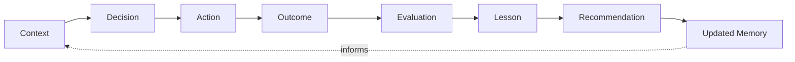

# Learning Loop

AION's advantage compounds only if it learns from **real outcomes**, not from
the volume of model output. The learning loop is the mechanism that turns what
actually happened into better future decisions.

## The loop

| Stage | What it is | Where it lives |
|---|---|---|
| **Context** | The information a decision was made against. | intelligence / aion-data |
| **Decision** | What the control plane chose to do. | control plane (recorded as events) |
| **Action** | The work execution performed. | execution (emits events) |
| **Outcome** | The real-world result of the action. | aion-data (outcome records) |
| **Evaluation** | Judging the outcome against success criteria. | evals / aion-core |
| **Lesson** | A validated conclusion drawn from the evaluation. | aion-data (lessons) |
| **Recommendation** | Forward-looking guidance derived from lessons. | aion-data (recommendations) |
| **Updated memory** | Retained context, revised by the lesson. | aion-data (memory) |

## Why outcomes, not generations

The learning system must **not** learn merely from model generations. A model
producing more text is not evidence of anything. Learning connects the full
chain — context → decision → action → **outcome** → evaluation → lesson →
recommendation → updated memory — and weights **real-world outcome quality**
above output volume.

Example: an agent that sends 100 proposals (`proposal.sent` ×100) has produced
volume. The loop learns from `payment.received`, `deal.lost`, and the evaluated
quality of the outcomes — not from the fact that 100 proposals existed.

## Preconditions the loop depends on

The loop only works because of guarantees made elsewhere:

- **Events are honest facts** ([event-standards](../engineering/event-standards.md)),
  so outcomes can be reconstructed.
- **Outcomes are recorded distinctly** from memory and analytics
  ([data-layer](data-layer.md)), so lineage survives.
- **Actions are observable end-to-end** ([observability](observability.md)), so
  a lesson can be tied to what produced it.
- **Evals exist** ([evals](../engineering/evals.md)), so evaluation is more than
  vibes.

## Invariants

- **A lesson must trace to the outcome(s) that justify it.** No lessons from
  thin air.
- **Lessons are validated, not asserted.** A conclusion becomes a lesson after
  evaluation, not because a model claimed it.
- **Memory is updated *by* lessons**, keeping the distinction between raw
  retained context and validated conclusions.
- **The loop feeds strategy, execution, products, and operations** — not just a
  single model prompt.
