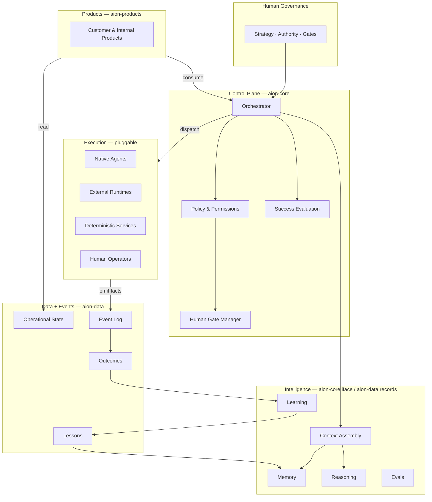

# Logical Architecture

This document describes the internal layers of AION and how a unit of work flows
through them. It sits between [system-context.md](system-context.md) (the
outside view) and the individual layer documents.

## The layers

## Responsibilities per layer

- **Governance** — Sets direction and holds the approvals that gates require.
  Not software; enforced by [governance/](../governance/README.md).
- **Control Plane** — The decision-maker. Receives intent, assembles required
  context, applies policy, decides which capability executes, inserts human
  gates where policy requires, and evaluates success. See
  [control-plane.md](control-plane.md).
- **Intelligence** — Supplies the control plane and execution with context,
  memory, reasoning, and evaluation signals. See
  [intelligence-layer.md](intelligence-layer.md).
- **Execution** — Actually performs work. Interchangeable environments behind a
  common contract. See [execution-layer.md](execution-layer.md).
- **Data + Events** — The system of record. Distinct stores for state, events,
  outcomes, lessons, and analytics. See [data-layer.md](data-layer.md).
- **Products** — Consume platform primitives and canonical data. See
  [product-layer.md](product-layer.md).

## How a unit of work flows

1. **Intent** arrives — from a mission, a product, a schedule, or a human.
2. The **orchestrator** classifies the work and assembles required **context**
   from the intelligence layer.
3. **Policy & permissions** are applied: which capabilities are allowed, what
   data is in scope, what [risk level](../governance/risk-levels.md) this is.
4. If policy requires, a **human gate** pauses the work for approval. See
   [human-gates.md](../governance/human-gates.md).
5. The orchestrator **dispatches** to an execution environment through the
   common execution contract.
6. Execution performs the work and **emits events** — completed facts — into
   the event log.
7. **Outcomes** are recorded and **evaluated** against the success criteria the
   orchestrator set.
8. The **learning loop** turns outcomes into lessons that update memory. See
   [learning-loop.md](learning-loop.md).
9. Every step is **observable** end-to-end. See
   [observability.md](observability.md).

## Invariants

- **Deciding and doing are different steps in different layers.** The
  orchestrator never becomes a worker; a worker never rewrites policy.
- **Context is assembled, not assumed.** Execution receives an explicit context
  reference, not ambient global state.
- **Facts flow one way into the event log.** Downstream stores (outcomes,
  lessons, analytics) derive from events; they are not edited in place to
  rewrite history.
- **Products never reach around the control plane** to perform governed actions.
