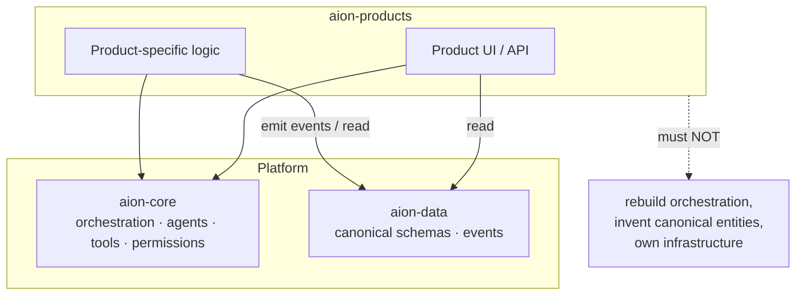

# Product Layer

Products are where AION delivers value: customer-facing and internal
applications built **on top of** the platform. Home repository:
**aion-products**.

The governing rule: **products consume platform primitives and canonical data —
they do not rebuild infrastructure locally.**

## What lives in the product layer

- customer-facing products;
- internal operational products;
- **product seeds** — early-stage products still proving their mission;
- experiments that have passed the appropriate [mission gate](../missions/lifecycle.md);
- interfaces built using the core platform and canonical data contracts.

## How products relate to the platform

- Products **call the control plane** to perform governed actions; they never
  reach around it. See [control-plane.md](control-plane.md).
- Products **read canonical data** and **emit events** through the data layer's
  owned paths; they never invent a competing canonical entity. See
  [data-layer.md](data-layer.md).
- Products **use platform tools and agents**; they do not embed their own
  orchestration engine or permission system.

## Product-specific vs. platform

A product may hold logic that is genuinely specific to it (its screens, its
domain workflow). It must not hold logic that belongs to the platform:

| Belongs in a product | Belongs in the platform |
|---|---|
| Product UI and its flows | Orchestration / routing |
| Domain-specific presentation | Permissions & policy enforcement |
| Product-scoped configuration | Canonical entity definitions |
| A workflow used by only this product | A workflow reused across products |

When a product-scoped capability proves reusable, it is **considered** for
promotion to a platform primitive — but only under the
[platformization rule](../roadmap/platform-maturity.md#platformization-rule),
never automatically.

## Missions gate products

Products are created through **explicit missions**, not ad hoc. A product seed
exists because a mission justified it; it advances or is killed based on
validated outcomes. See [../missions/lifecycle.md](../missions/lifecycle.md).

## Invariants

- **Consume, don't rebuild.** Infrastructure, orchestration, and canonical data
  come from the platform.
- **No reach-around.** Governed actions go through the control plane.
- **No shadow canonical data.** Products project and cache; they do not own
  canonical entities.
- **Every product traces to a mission.**
