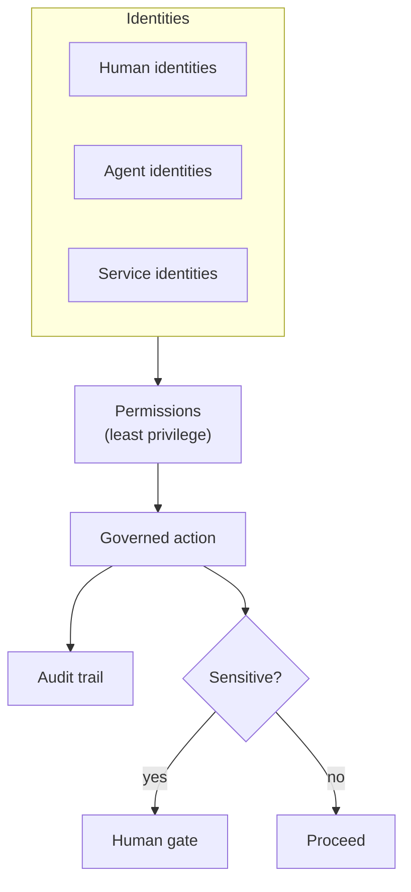

# Security Model

AION's security posture is **least privilege everywhere**: every identity —
human, agent, or service — gets only the access a specific unit of work
requires, and every sensitive action is auditable and, where policy demands,
gated by a human.

This document defines the architectural model. Concrete infrastructure (secret
stores, network isolation, IAM) is owned by `aion-infra`; approval policy is
owned by [governance/](../governance/README.md).

## Identities

| Identity | Description |
|---|---|
| **Human identities** | People acting in AION; carry authority and approval rights. |
| **Agent identities** | Each governed worker has its own identity, scope, and forbidden actions. See [../governance/agent-governance.md](../governance/agent-governance.md). |
| **Service identities** | Deterministic services and integrations act under their own scoped identity. |

No shared or ambient "god" identity. Every actor is attributable.

## What the model governs

- **Environment isolation** — environments are separated so a lower environment
  cannot reach production. See [environments.md](environments.md).
- **Secret handling** — secrets live in a managed secret system (owned by
  `aion-infra`); **no secret is ever committed to documentation or any
  repository**.
- **Data classification** — data is classified so access and handling match
  sensitivity; classification drives what an agent may read.
- **Audit trails** — every governed action is recorded per
  [observability.md](observability.md).
- **Approval gates** — sensitive actions require human approval. See
  [../governance/human-gates.md](../governance/human-gates.md).
- **Destructive action controls** — destructive operations are gated and
  reversible-by-design where possible.
- **External communication controls** — outbound communication to customers or
  third parties is permissioned and, at higher risk, gated.
- **Production deployment controls** — production releases follow the change
  process and, where policy requires, human approval. See
  [../governance/change-management.md](../governance/change-management.md).

## Least privilege in practice

- Agents and runtimes receive **only** the tools and data their work requires
  (declared in their input contract).
- Context is passed **by reference and minimized**, so a worker never sees more
  than it needs. See [intelligence-layer.md](intelligence-layer.md).
- Permissions are explicit and owned; there is one canonical permission
  definition per capability. See [../governance/permissions.md](../governance/permissions.md).

## Hard rules

- **No secrets in any repository or document — ever.**
- **No ambient authority.** Every action is attributable to an identity.
- **Least privilege by default; escalation is explicit and gated.**
- **Destructive, financial, and external-communication actions are high-risk by
  default** and follow [risk-levels.md](../governance/risk-levels.md).
