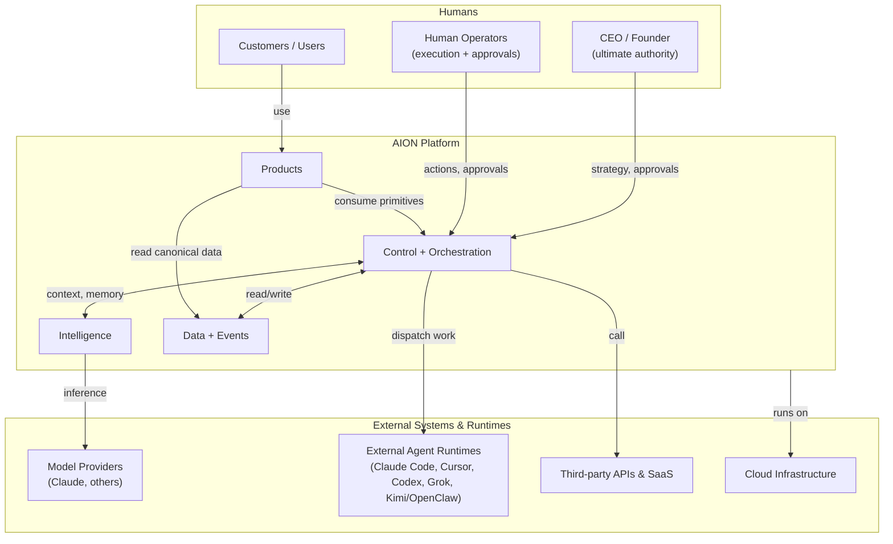

# System Context

This document draws the boundary of AION: who and what sits outside it, and how
they interact with it. It is the outermost view — one level above
[logical-architecture.md](logical-architecture.md).

## External actors

| Actor | Relationship to AION |
|---|---|
| **CEO / Founder** | Holds ultimate authority. Sets strategy; approves financial, destructive, and high-risk actions via [human gates](../governance/human-gates.md). |
| **Human operators** | Execute work AION routes to them and grant approvals at gates. They are a first-class execution environment, not an afterthought. |
| **Customers / users** | Interact only with **products**, never with the control plane directly. |

## External systems

| System | Role | Coupling rule |
|---|---|---|
| **Model providers** | Provide inference for reasoning and generation. | AION must not be coupled to one model. |
| **External agent runtimes** | Claude Code, Cursor, Codex, Grok, Kimi/OpenClaw, etc. Perform execution work. | Treated as interchangeable execution environments behind a common interface. |
| **Third-party APIs / SaaS** | CRMs, payment, comms, analytics vendors. | Accessed as tools under permissions; never a hidden source of canonical truth. |
| **Cloud infrastructure** | Hosts the platform. Owned by `aion-infra`. | Infrastructure supports the architecture; it does not dictate it. |

## Boundary rules

1. **Customers touch only products.** The control plane, intelligence, and data
   layers are internal.
2. **External runtimes are pluggable.** No AION logic assumes a specific agent
   runtime or model. See [execution-layer.md](execution-layer.md).
3. **Every external call is a governed tool call.** It carries identity,
   permissions, and observability. See [security-model.md](security-model.md).
4. **No external system owns canonical business entities.** AION mirrors what it
   needs into `aion-data` with explicit ownership. See
   [data-layer.md](data-layer.md).
