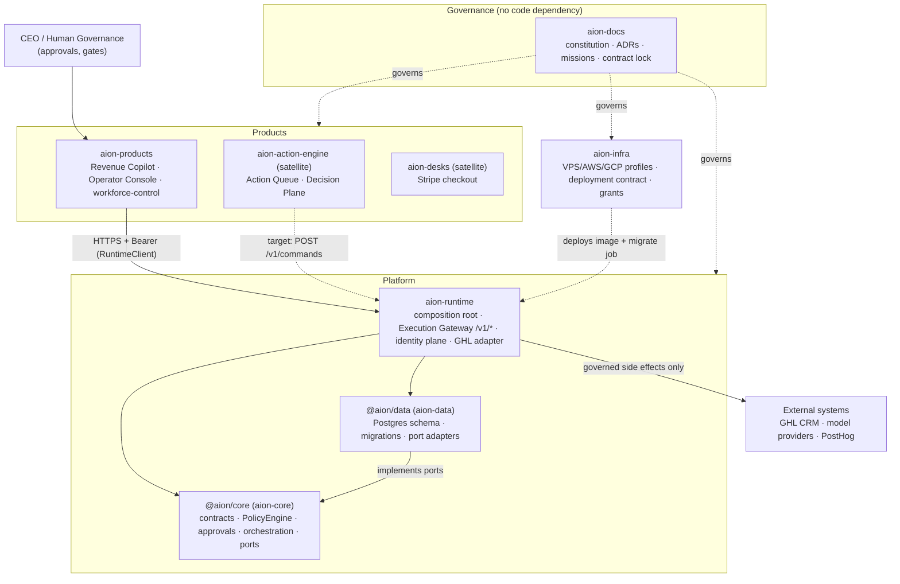

# System Integration Overview

> Snapshot from the **2026-09-26 cross-repository integration audit**. It maps
> the architectural layers onto the repositories as they are actually wired,
> records which seams were disconnected and how they were fixed, and lists the
> ordered next steps to production. Normative rules stay in
> [../repositories/dependency-rules.md](../repositories/dependency-rules.md).

## 1. Layers → repositories

| Architectural layer ([system-overview](system-overview.md)) | Implemented in |
|---|---|
| Control + Orchestration | `@aion/core` (PolicyEngine, ApprovalGate, Orchestrator, MissionOrchestrator), hosted by `aion-runtime` |
| Execution | `aion-runtime` Execution Gateway + adapters (GHL), `HarnessExecutionProvider` seam (ADR-011) |
| Intelligence | `aion-products` engines; `@aion/decision-engine` (ADR-009) in `aion-action-engine` |
| Data + Events | `@aion/data` (13 migrations: executions, outcomes, services, workflows, evals, autonomy grants, side effects, implementation cases, revenue sessions, tenant RLS scaffold) |
| Products | `aion-products` (deployed via Vercel + VPS `revenue-copilot` profile), `aion-desks` |
| Infra | `aion-infra` (VPS profile ACTIVE: Traefik + runtime + copilot + Postgres) |

## 2. How one governed task flows

1. **Product** (Copilot / Operator Console) calls `RuntimeClient` →
   `POST /v1/commands` with `serviceKey`, bearer token and tenant.
   Staging/production fail closed without `AION_RUNTIME_URL` / API key (ADR-005, ADR-007).
2. **Runtime** authenticates the principal (identity plane), resolves
   `serviceKey` → capability via the Service Catalog (`services` table).
3. **Core** `PolicyEngine` authorizes: tenant scope, identity, action tier,
   autonomy grant, risk (R0–R3) → ALLOW / DENY / REQUIRE_APPROVAL.
4. R2+ parks at a **human gate**; `POST /v1/approvals/:id/decision` resumes it.
5. The execution adapter performs the side effect (e.g. GHL), recorded
   idempotently in `external_side_effects`; the `aion_execution` object and an
   **Outcome** are persisted by **Data**; events + telemetry are append-only.
6. Evaluations / trust score / economics roll up for the **learning loop**.

## 3. Audit findings

### Fixed on `claude/aion-architecture-audit-ccq3bs`

| # | Disconnect | Fix |
|---|---|---|
| F1 | **Four different `@aion/core` contract surfaces.** Data pinned `0c58a7c` (side branch), Runtime `72294ec` (reachable from *no* branch — a fresh clone could stop resolving it once GitHub GCs it), Products `5ea731a` (Phase 1, 12 commits behind). | Landed the missing contracts (ImplementationCase, Secure Automation, M009 Phase A 15-key catalog, `inactive` service status) on core main lineage → `6993013`; all consumers pin it. Lock recorded in [`../releases/platform-contract-lock.json`](../releases/platform-contract-lock.json). |
| F2 | **Forked schema lineage.** Runtime vendored Data from a side branch whose `0009/0010` (implementation cases) collided with main's `0009/0010` (revenue sessions, tenant RLS), patched at install time by an overlay script. | Implementation cases landed on Data main as `0011/0012`, `0013` mirrors the core enum; overlay script deleted; Runtime pins Data `b49deec`. |
| F3 | Existing pilot DB migrated on the forked lineage would fail the migrate job (checksum mismatch) on any re-pin. | `reconcileLegacyMigrationLineage` relabels the exact legacy `(version,name)` rows in one transaction (no DDL re-run) + test. |
| F4 | `aion-action-engine` published a package named **`@aion/core`**, shadowing the canonical kernel. | Renamed to `@aion/action-core`. |
| F5 | Docs drew `core → data`; code (correctly) is `data → core` (ports & adapters). | [dependency-rules.md](../repositories/dependency-rules.md), repo README and `.aion` map corrected. |
| F6 | `aion-action-engine` absent from ownership docs. | [repositories/aion-action-engine.md](../repositories/aion-action-engine.md). |

Verification: core 201/201 tests + lint/typecheck/build; data 91/91 tests on
real Postgres 16; runtime typecheck + gateway 92/92 + proof-safety 14/14 +
AIO-17 fixtures 14/14 + migrate job 13/13; products typecheck + 79/79;
action-engine build/typecheck/tests green.

### Open (needs a decision or a larger change)

| # | Gap | Impact |
|---|---|---|
| O1 | **Tenant RLS vs Runtime.** Data `0010` *enables* RLS on `executions`, `approvals`, `autonomy_grants`. Because `aion_app` is not the table owner, `ENABLE` already applies to it (FORCE only matters for owners), and Runtime never sets `aion.tenant_id`. The durable revenue-workflow proof fails on the new pin ("failed to save execution") — most likely this. | **Blocks deploying the new Runtime pin.** Fix forward: Runtime sets `aion.tenant_id` per request-scoped transaction (ADR-005 follow-on). |
| O2 | **Two Revenue Copilots.** `AION-Sys/Ceoloo-aion-revenue-copilot` (+ `aion-software-factory` process) is active, uses its own Supabase entities and a completion proxy, never the Execution Gateway; ADR-001 calls AION-Sys legacy. | Duplicated canonical entities (lead/outcome) and ungoverned writes. Needs a carry-forward ADR: absorb, bridge to Runtime, or retire. |
| O3 | Action Engine approvals/execution run outside the Gateway on SQLite. | Parallel approval semantics; outcomes not canonical. Bridge per [aion-action-engine.md](../repositories/aion-action-engine.md). |
| O4 | Pins are hand-maintained in three scripts. | Drift will recur. Add a CI check that each consumer's pin equals the lock. |
| O5 | Two mission numbering schemes (aion-docs M001–M009 vs software-factory MISSION-001/002). | Ambiguous references across repos. |

## 4. Next steps to production (ordered)

1. **Merge the alignment in dependency order** — core → data → runtime →
   products → action-engine → docs — using merge commits (not squash) so the
   pinned SHAs stay reachable, or re-pin to the merge commits and update the lock.
2. **Close O1**: set `aion.tenant_id` in Runtime per request transaction, then
   re-run `proof:revenue-workflow`, `proof:mission003` (tenant attack suite)
   and `certify:platform-v020`. Only then publish a new runtime digest.
3. **Staging rehearsal of the migrate job against a copy of the pilot DB** to
   prove F3 reconciliation on real history; record the digest + SHA.
4. **Finish Track A go-live** ([../roadmap/production-golive.md](../roadmap/production-golive.md)):
   auth required, gateway keys, Copilot bearer, CORS `PATCH`, rollback + alerts.
5. **Pin-lock CI (O4)** in data/runtime/products.
6. **Decide O2 by ADR** (recommended: bridge the AION-Sys copilot's writes to
   `POST /v1/commands` and converge on one Revenue Copilot, then retire the
   duplicate), and move the software-factory process into `aion-docs/.aion`.
7. **Bridge the Action Engine (O3)** to the Gateway once a mission needs it.
8. Tag `execution-platform-v0.2.x` from the certified tip.
