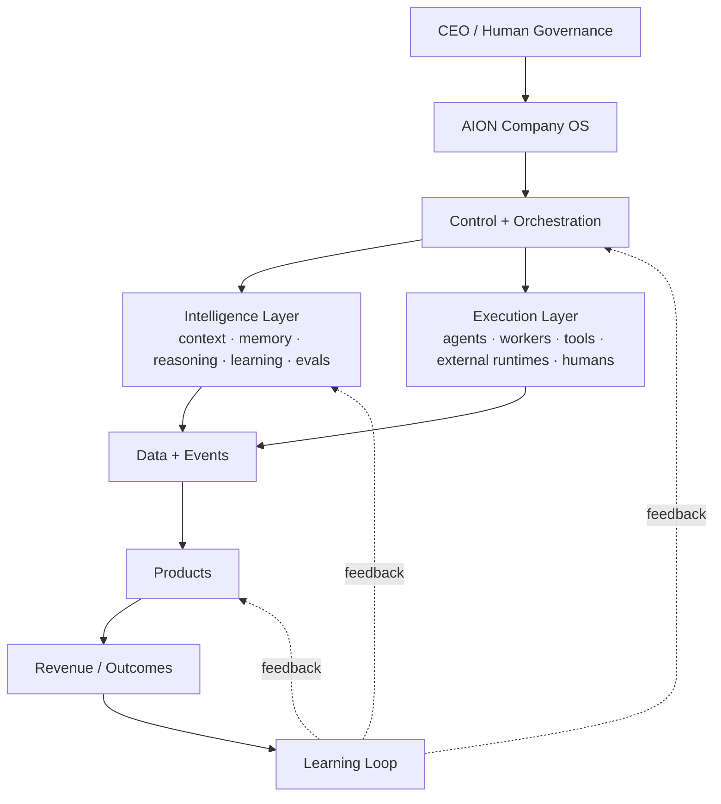

# System Overview

## What AION is

AION is an **AI-native company and product operating architecture**: a governed
system that designs, builds, extends, operates, and learns from products, while
humans retain ultimate authority.

It is best understood as a set of layers with explicit responsibilities and
explicit seams between them.

## The layers

| Layer | Responsibility | Home repo |
|---|---|---|
| **Human governance** | Ultimate authority: strategy, financial commitment, high-risk approval. | — (people + [governance/](../governance/README.md)) |
| **Company OS** | The operating substrate: identities, policies, mission registry, org context. | aion-core |
| **Control + Orchestration** | Decides *what* happens, *which* capability handles it, *what* context and policy apply, *whether* a human gate is required, *how* success is judged. | aion-core |
| **Intelligence** | Supplies context, memory, reasoning, learning, and evaluation. | aion-core (interfaces) + aion-data (durable records) |
| **Execution** | Performs the work: native agents, external agent runtimes, deterministic services, human operators. | aion-core (interfaces) + aion-products / external |
| **Data + Events** | Canonical schemas, immutable events, memory, lessons, analytics. | aion-data |
| **Products** | Customer-facing and internal products built on platform primitives. | aion-products |
| **Learning Loop** | Turns real outcomes into validated lessons and updated memory. | aion-data + aion-core |

## What AION is **not**

AION is **not designed as one giant autonomous agent.** It is designed as a
governed system where:

- **humans retain ultimate authority;**
- **orchestration is separate from execution** — deciding is not doing;
- **strategy is separate from runtime workers;**
- **data has explicit ownership** — one canonical owner per entity;
- **every significant action is observable;**
- **agents operate under permissions;**
- **important actions can require human gates;**
- **learning is derived from real outcomes,** not from generation volume;
- **products are created through explicit missions;**
- **reusable capabilities become platform primitives** only when justified;
- **premature infrastructure is avoided.**

## The seams that must not blur

These are the boundaries whose erosion caused the reset (see
[ADR-001](../adr/ADR-001-greenfield-reset.md)). They are load-bearing:

1. **Orchestration ≠ execution.** See [control-plane.md](control-plane.md) and
   [execution-layer.md](execution-layer.md).
2. **Platform ≠ product.** Products consume primitives; they do not rebuild
   them. See [product-layer.md](product-layer.md).
3. **Canonical data ≠ per-service data.** One owner per entity. See
   [data-layer.md](data-layer.md).
4. **Event ≠ command.** Events are completed facts. See
   [../engineering/event-standards.md](../engineering/event-standards.md).
5. **Memory ≠ lessons ≠ analytics.** Distinct data kinds, not one store. See
   [data-layer.md](data-layer.md).

## Design posture

- **Mission before infrastructure.** ([principle](../engineering/principles.md))
- **Least privilege everywhere.** ([security](security-model.md))
- **Capabilities over vendors.** Defer vendor choice to an ADR when not
  finalized.
- **Reliable outcomes over maximum autonomy.** Autonomy is a means, governed and
  earned per workflow — never the objective.
