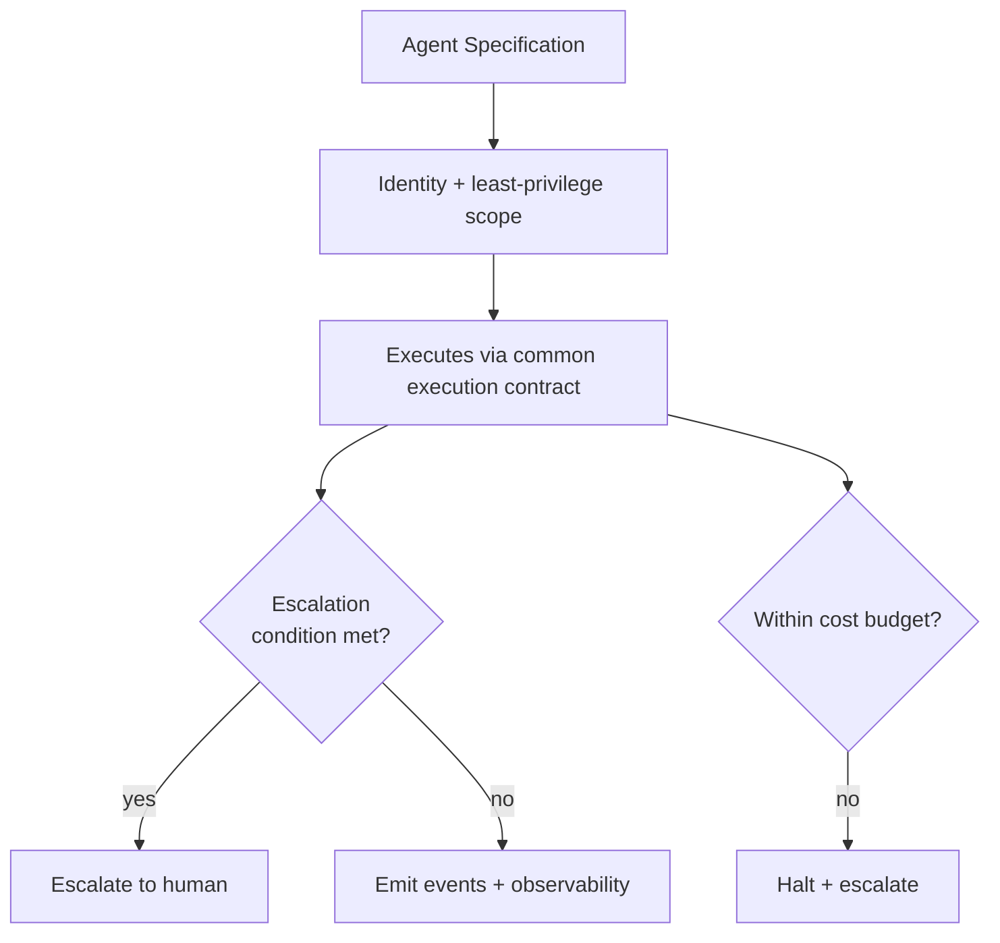

# Agent Governance

Agents in AION are **governed workers**, not vague personalities with
unrestricted access. Every agent operates under an explicit specification that
bounds what it may do, see, and spend.

## The agent specification

Each agent should eventually have all of the following defined:

| Field | Meaning |
|---|---|
| **Agent ID** | Unique, attributable identity. |
| **Purpose** | The one job this agent exists to do. |
| **Owner** | The human/team accountable for it. |
| **Capabilities** | What it is able to do. |
| **Allowed tools** | The exact tools it may invoke. |
| **Allowed data** | The data it may read/write — least privilege. |
| **Forbidden actions** | Explicit prohibitions. |
| **Risk level** | Its default [risk level](risk-levels.md). |
| **Escalation conditions** | When it must stop and escalate to a human. |
| **Input contract** | The shape of work it accepts. |
| **Output contract** | The shape of results it returns. |
| **Evaluation criteria** | How its output quality is judged ([evals](../engineering/evals.md)). |
| **Cost controls** | Token/cost budget and limits. |
| **Observability requirements** | What it must emit to be traceable. |

An agent without these is not production-eligible. See
[../engineering/production-readiness.md](../engineering/production-readiness.md).

## Governed, not autonomous-by-default

- Agents are one of several **execution environments**; they follow the common
  execution contract. See [../architecture/execution-layer.md](../architecture/execution-layer.md).
- Agents receive **only** the tools and data their work requires. See
  [permissions.md](permissions.md) and
  [../architecture/security-model.md](../architecture/security-model.md).
- Agents do **not** set their own policy, waive their own gates, or exceed their
  cost controls.

## Anti-patterns (explicitly rejected)

- **The unrestricted assistant.** An agent with broad tool and data access and a
  personality instead of a spec.
- **The self-authorizing agent.** An agent that decides its own permissions or
  approves its own high-risk actions.
- **The unbounded agent.** No cost control, no escalation condition, no
  evaluation criteria.
- **The untraceable agent.** Work that cannot be followed through the
  observability spine.

## Invariants

- **Every agent has an owner, a purpose, a scope, and forbidden actions.**
- **Least privilege for tools and data.**
- **Escalation and cost controls are mandatory.**
- **Every agent action is observable and evaluable.**
