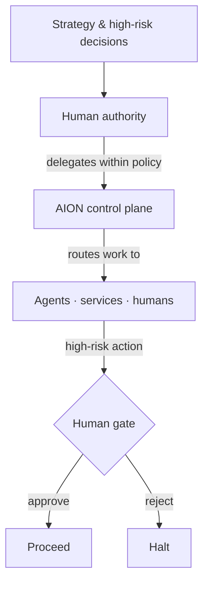

# Authority Model

Authority in AION answers two questions: **who decides** (human authority) and
**who owns** (canonical ownership). Both are explicit.

## Human authority is ultimate

Humans retain authority over:

- **financial commitments;**
- **destructive actions;**
- **production releases where policy requires approval;**
- **customer-sensitive decisions;**
- **high-risk external communications;**
- **security-sensitive configuration;**
- **strategic direction.**

AION may propose, prepare, and recommend in these areas, but the decision is
gated to a human. The mechanism is the [human gate](human-gates.md).

## Canonical ownership

**Every** business entity, schema, event, workflow, service, agent, product,
metric, permission, and API contract has **exactly one canonical owner.**

| Artifact | Canonical owner lives in |
|---|---|
| business entity, schema, event | aion-data |
| workflow, agent, permission, tool contract | aion-core |
| product, product experiment | aion-products |
| environment, secret store, deployment pattern | aion-infra |
| architecture, standard, ADR, terminology | aion-docs |

Ownership means the owner defines it, changes it, and is accountable for it.
Everyone else consumes it.

## Why single ownership

Duplicate sources of truth were a primary cause of the
[greenfield reset](../adr/ADR-001-greenfield-reset.md). When two places define
"a lead" or "a deployment," they drift, and the system can no longer reason
about itself. Single ownership is therefore an **invariant**, not a preference.

## Resolving ownership disputes

If two repositories appear to own the same thing:

1. Treat it as a **drift signal**, not an acceptable duplication.
2. Decide the single owner using the [dependency
   rules](../repositories/dependency-rules.md) and this table.
3. If the decision is architecturally significant, record it as an
   [ADR](../adr/README.md).

## Invariants

- **Humans hold ultimate authority over high-risk and strategic decisions.**
- **One canonical owner per artifact — always.**
- **Delegation to AION is within policy and revocable.**
