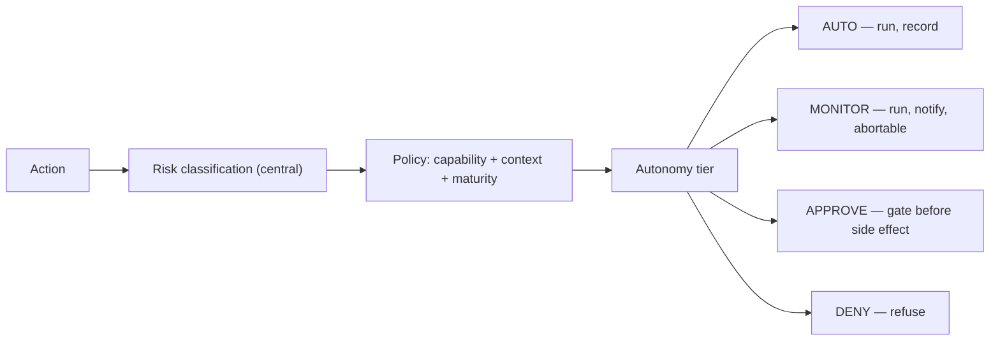

# Autonomy Tiers

[Risk levels](risk-levels.md) classify *how dangerous* an action is.
[Human gates](human-gates.md) are the binary pause when policy demands approval.
**Autonomy tiers** sit between them: they describe *how much independence* a
workflow has earned for a given class of action — from fully autonomous to fully
gated — so AION can grant graduated trust instead of a single on/off switch.

This formalizes the graduated-autonomy direction in the
[2026 Runtime-Control Brief](../research/2026-runtime-control-brief.md) (signal
4, IBM CUGA), which places policy enforcement at structural checkpoints *around*
the reasoning loop rather than inside it. AION already enforces policy centrally
and outside the worker; this document adds the missing gradient.

## The four tiers

| Tier | Meaning | The system… | Human role |
|---|---|---|---|
| **AUTO** | Trusted to run unattended. | executes and records. | reviews in aggregate, after the fact. |
| **MONITOR** | Runs, but surfaced for real-time visibility. | executes and notifies. | can intervene/abort; no approval needed to proceed. |
| **APPROVE** | Must be cleared before the side effect. | pauses at a [human gate](human-gates.md). | approves or rejects before execution. |
| **DENY** | Not permitted in this context. | refuses and records. | — (change scope/policy to enable). |

`APPROVE` is exactly the existing human gate; `DENY` is exactly a policy denial.
The new tiers are `AUTO` and `MONITOR`, which distinguish "run silently" from
"run, but watch me" — a distinction that binary gating cannot express.

## Tier is derived, never self-assigned

The tier is a function of **risk level × capability × context × earned
maturity**, decided by the control plane's policy engine — the same authority
that classifies risk and requires gates. A worker never raises its own tier, and
central classification never *lowers* risk to reach a more autonomous tier
(mirrors [risk-levels](risk-levels.md): risk is never lowered by the executing
worker).

## How tiers relate to risk and maturity

- **High-risk (R3) categories cannot reach AUTO or MONITOR.** Financial,
  destructive, customer-sensitive, production-release, and security-sensitive
  actions stay at `APPROVE` (or `DENY`) **regardless of maturity** — the fixed
  rule from [risk-levels](risk-levels.md) and
  [authority-model](authority-model.md).
- **Autonomy is earned, not defaulted.** A low-risk workflow starts at
  `MONITOR` or `APPROVE` and is promoted toward `AUTO` only after **validated
  outcomes** ([platform-maturity](../roadmap/platform-maturity.md) L4). Promotion
  is a governed change ([change-management](change-management.md)), recorded and
  reversible.
- **Demotion is always available and fast.** A workflow that starts producing
  bad outcomes is demoted (AUTO → MONITOR → APPROVE) without ceremony; safety
  never waits for a committee.

## Why not just gate everything

Over-gating low-risk work destroys throughput and trains humans to rubber-stamp;
under-gating high-risk work destroys trust ([human-gates](human-gates.md) design
requirement #5). Tiers let AION apply *proportional* control: read a report at
`AUTO`, send an internal draft at `MONITOR`, issue a refund at `APPROVE`. The
CodeAct/PTC efficiency gains in the brief (fewer model turns) are only bankable
if low-risk chains can actually run unattended — which requires `AUTO` to exist.

## Observability

The chosen tier is recorded on the [trace](../architecture/observability.md)
alongside `risk_level` and `approval_state`, so every action is auditable for
*how autonomously it was allowed to run* and *whether that was appropriate in
hindsight* — a direct input to the [learning loop](../architecture/learning-loop.md)
and to tier promotion/demotion decisions.

## Invariants

- **R3 / high-risk categories never reach AUTO or MONITOR.**
- **Autonomy is earned through validated outcomes; the default is more control,
  not less.**
- **Tiers are assigned centrally by policy; a worker never raises its own tier.**
- **Demotion to a stricter tier is always immediately available.**
- **The autonomy tier is recorded on the trace.**
