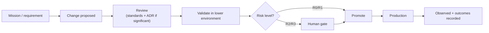

# Change Management

How changes reach production. Change management ties together
[risk levels](risk-levels.md), [human gates](human-gates.md), and
[environments](../architecture/environments.md) into one governed path.

## The path to production

## Principles

- **Change is tied to a mission or a stated requirement.** No production change
  exists without a reason recorded somewhere traceable.
- **Architecturally significant changes require an ADR.** Boundary, ownership,
  cross-repo contract, or vendor-selection changes are recorded before they
  ship. See [../adr/README.md](../adr/README.md).
- **Promotion is governed, not a copy.** Moving to a higher environment follows
  the promotion path with the isolation guarantees of
  [environments.md](../architecture/environments.md).
- **Risk decides the gate.** R3 (and R2 where policy requires) changes need
  human approval before they reach production.
- **Every change is observable.** The change and its outcome are traceable.

## What "significant enough for an ADR" means

Record an ADR when a change:

- alters a **repository boundary** or **ownership**;
- changes a **cross-repo contract** (event, data, or API);
- **selects or replaces a vendor/technology** previously left open;
- changes a **governance rule** (a permission model, a gate policy, a risk
  mapping).

Routine, reversible, in-boundary changes do **not** need an ADR — do not create
ADR noise.

## Rollback and reversibility

- Prefer changes that are **reversible by design**, especially destructive ones.
- Destructive and irreversible changes are **R3** and gated. See
  [risk-levels.md](risk-levels.md).

## Invariants

- **No production change without a traceable reason.**
- **Significant changes are ADR-backed before shipping.**
- **Risk-appropriate gates precede production.**
- **Promotion is governed and observable.**
