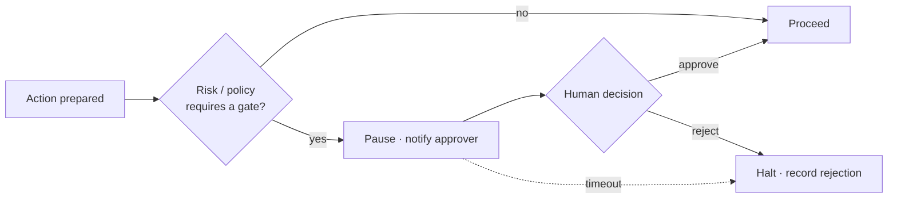

# Human Gates

A **human gate** is a point in a workflow where AION pauses and a human must
approve before work continues. Gates are how [human
authority](authority-model.md) is enforced at runtime.

## What a gate is

A gate:

- **pauses** the run before the sensitive action executes;
- **presents** the human with the context, the proposed action, and its
  [risk level](risk-levels.md);
- **records** the decision (approve/reject) in the observability trace as
  `approval_state`; see [../architecture/observability.md](../architecture/observability.md);
- **fails safe** — if approval is not granted (rejection or timeout), the action
  does not happen.

## When a gate is required

By default, a gate is required for actions that touch human authority:

- financial commitments;
- destructive actions;
- production releases where policy requires approval;
- customer-sensitive decisions;
- high-risk external communications;
- security-sensitive configuration.

Whether a specific action needs a gate is determined by its
[risk level](risk-levels.md) and policy — decided by the control plane's policy
engine, **not** by the worker executing the action.

## Design requirements

1. **The gate decision is policy-driven, not worker-driven.** A worker cannot
   waive its own gate.
2. **Gates fail safe.** No approval → no action.
3. **Gates are observable.** Every gate outcome is in the trace.
4. **Gates carry enough context to decide.** The approver sees the proposed
   action, its inputs, and its risk — without needing to reconstruct state.
5. **Gates are minimal but sufficient.** Over-gating low-risk work destroys
   throughput; under-gating high-risk work destroys trust. Calibrate via
   [risk-levels.md](risk-levels.md).

## Relationship to autonomy maturity

As workflows earn trust through validated outcomes, some low-risk gates may be
removed so that low-risk work executes autonomously **within policy** (maturity
L4). High-risk gates do not disappear with maturity. See
[../roadmap/platform-maturity.md](../roadmap/platform-maturity.md).

## Invariants

- **High-risk actions are gated by default.**
- **A worker never approves its own gate.**
- **No approval, no action — always.**
