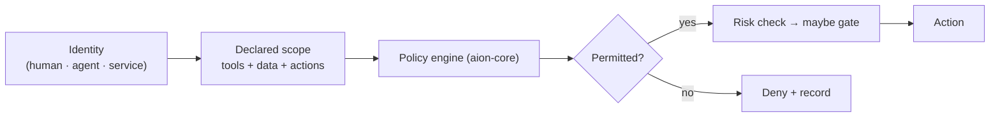

# Permissions

AION's permission model is **least privilege, explicitly owned, and enforced by
the control plane.** Every identity — human, agent, or service — acts only
within a declared scope.

## Model

- **Permissions are declared, not implied.** An identity's allowed tools,
  allowed data, and allowed actions are explicit.
- **Enforcement is central.** The control plane's policy engine evaluates
  permissions at dispatch; workers do not self-grant. See
  [../architecture/control-plane.md](../architecture/control-plane.md).
- **Permission definitions are owned.** Each permission/capability has one
  canonical definition (in `aion-core`), consistent with
  [authority-model.md](authority-model.md).

## Least privilege in practice

- An agent's spec lists exactly the tools and data it may use; it gets no more.
  See [agent-governance.md](agent-governance.md).
- Context is passed **by reference and minimized**, so a worker cannot read data
  outside its scope. See
  [../architecture/intelligence-layer.md](../architecture/intelligence-layer.md).
- Escalation of privilege is **explicit and, where sensitive,
  [gated](human-gates.md)** — never ambient.

## Permissions and risk

Being *permitted* to do something is not the same as being *cleared* to do it
now. A permitted action that is high-risk still passes through a
[risk check](risk-levels.md) and may require a [human gate](human-gates.md).
Permission is necessary but not always sufficient.

## Relationship to data classification

Allowed data is constrained by data classification (see
[../architecture/security-model.md](../architecture/security-model.md)): an
identity may read a data class only if its scope explicitly allows that class.

## Invariants

- **Deny by default; allow by explicit scope.**
- **Central enforcement; no self-granting.**
- **One canonical definition per permission.**
- **Permission ≠ automatic clearance** for high-risk actions.
