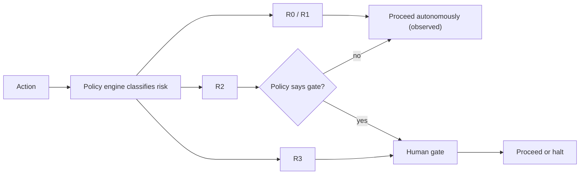

# Risk Levels

Risk level is the single classification that drives how much control an action
requires: whether it can run autonomously, whether it needs a
[human gate](human-gates.md), and how closely it must be observed.

## The levels

| Level | Meaning | Examples | Default control |
|---|---|---|---|
| **R0 — Trivial** | No meaningful blast radius. Easily reversible. | Read canonical data, draft internal text, run an eval. | Autonomous. Observed. |
| **R1 — Low** | Minor, reversible effects; internal scope. | Update internal state, create a draft, non-customer notification. | Autonomous within policy. Observed. |
| **R2 — Moderate** | External or harder-to-reverse effects. | Customer-facing message, non-destructive external API write. | Policy-dependent; may require a gate. |
| **R3 — High** | Financial, destructive, customer-sensitive, security-sensitive, or production-release effects. | Payment, production deploy, data deletion, high-risk external comms, security config. | **Human gate required.** |

Exact thresholds are tuned per workflow, but the mapping of **high-risk
categories → R3 → gate** is fixed.

## What is High risk by default

These categories map to R3 and are **gated by default** (see
[authority-model.md](authority-model.md)):

- financial commitments;
- destructive actions;
- production releases where policy requires approval;
- customer-sensitive decisions;
- high-risk external communications;
- security-sensitive configuration.

## How risk is used

- The **control plane** classifies risk at dispatch; the worker does not
  self-classify down.
- Risk level is recorded in the observability trace as `risk_level`. See
  [../architecture/observability.md](../architecture/observability.md).
- An agent carries a **default** risk level in its spec; a specific action may be
  classified higher based on context.

## Risk and maturity

Autonomy is extended to **low-risk** workflows first, and only after validated
outcomes (maturity L4). **High-risk actions remain gated regardless of
maturity.** See [../roadmap/platform-maturity.md](../roadmap/platform-maturity.md).

## Invariants

- **High-risk categories are R3 and gated by default.**
- **Risk is classified centrally, never lowered by the executing worker.**
- **Risk level is always recorded.**
