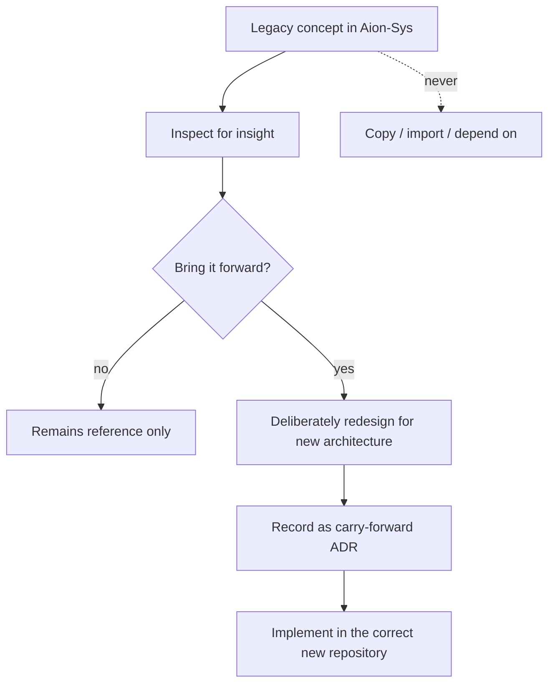

# Legacy Policy

This document governs how the new AION relates to the **Aion-Sys** GitHub
organization — the home of prior AION work.

## Status of Aion-Sys

**Aion-Sys repositories are historical R&D and architectural evidence.** They
remain untouched. They are **reference material only** — not part of the new
canonical platform.

The decision to reset rather than continue is recorded in
[ADR-001: Greenfield Reset](../adr/ADR-001-greenfield-reset.md).

## What legacy MAY be used for

Aion-Sys may be **inspected** to understand:

- prior requirements;
- domain models;
- product ideas;
- experiments;
- lessons;
- failure modes;
- useful interfaces.

This is valuable context. Reading it to learn is encouraged.

## What legacy must NOT be

Legacy repositories must **NOT**:

- be **imported as dependencies**;
- **determine the new architecture by default**;
- be **copied wholesale**;
- be treated as **production sources of truth**.

No repository in the new ecosystem (`aion-docs`, `aion-core`, `aion-data`,
`aion-infra`, `aion-products`) may depend on Aion-Sys. This is a hard
[dependency rule](../repositories/dependency-rules.md).

## Carry-forward: the only sanctioned path

When a concept from legacy is worth bringing into the new platform, it is
**deliberately redesigned** to fit the new architecture, or recorded as an
explicit **carry-forward decision** — an [ADR](../adr/README.md) stating what is
being carried forward, why, and how it was redesigned.

**A concept is never adopted by default or by copy.** The default answer is
"reference only"; adoption is a conscious, recorded act.

## Why this policy exists

The [reset](../adr/ADR-001-greenfield-reset.md) exists precisely because
building on top of accumulated legacy ambiguity was the problem. Letting legacy
back in silently — as a dependency, a copied file, or an unexamined assumption —
would recreate that problem. This policy keeps the new platform's boundaries and
ownership clean.

## Invariants

- **Aion-Sys is reference, never a dependency.**
- **No wholesale copying; no default adoption.**
- **Carry-forward is deliberate, redesigned, and ADR-recorded.**
- **The new platform is the only production source of truth.**
