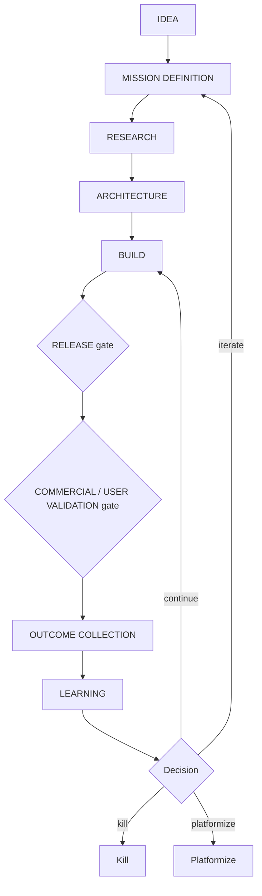

# Mission Lifecycle

Every product and significant capability moves through this lifecycle. The
lifecycle exists so that work is justified before it is built, validated before
it is trusted, and learned from after it ships.

## The lifecycle

| Stage | What happens |
|---|---|
| **Idea** | A candidate problem/opportunity is noted. Cheap; most ideas stop here. |
| **Mission definition** | The idea becomes a mission with owner, problem, user, outcome, scope, non-goals. Uses [mission-template.md](mission-template.md). |
| **Research** | Validate the problem, users, constraints, and prior art (including [legacy](../legacy/README.md) as reference only). |
| **Architecture** | Decide how it fits AION: boundaries, data, security, contracts. Significant choices become [ADRs](../adr/README.md). |
| **Build** | Implement to the [engineering standards](../engineering/README.md). |
| **Release** | Pass the **release gate** ([release-template.md](release-template.md)) — production-readiness and governance. |
| **Commercial / user validation** | Pass the **validation gate** ([validation-template.md](validation-template.md)) — did it deliver the expected outcome for real users? |
| **Outcome collection** | Capture real outcomes as events/records in `aion-data`. |
| **Learning** | Turn outcomes into lessons via the [learning loop](../architecture/learning-loop.md). |
| **Continue / Iterate / Kill / Platformize** | Decide the mission's fate from evidence. |

## The two gates

- **Release gate** — a mission cannot ship until it is
  [production-ready](../engineering/production-readiness.md) and governed
  (permissions, risk, human gates). Template:
  [release-template.md](release-template.md).
- **Validation gate** — a shipped mission cannot be called a success until real
  commercial/user validation confirms the expected outcome. Template:
  [validation-template.md](validation-template.md).

## The four terminal decisions

After learning, a mission is explicitly decided:

- **Continue** — it works; keep running/improving it.
- **Iterate** — promising but not there; refine the mission and loop back.
- **Kill** — it did not deliver; stop, and record the lesson.
- **Platformize** — a capability proved reusable; promote it to a platform
  primitive **only under** the
  [platformization rule](../roadmap/platform-maturity.md#platformization-rule).

## Invariants

- **No build without a defined mission.**
- **No ship without passing the release gate.**
- **No "success" claim without passing the validation gate.**
- **Every mission ends in an explicit decision, kill included.**
- **Killing is a valid, respected outcome** — it prevents speculative accretion.
