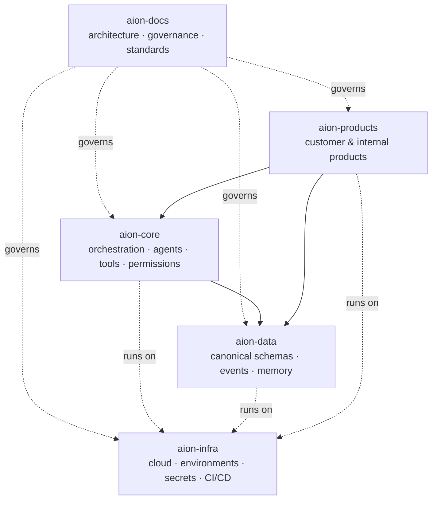

# Repository Ownership

AION is divided into five canonical repositories under the personal `Ceoloo`
account. Each has a **single, explicit responsibility**. Clear ownership is what
prevents the architectural drift that caused the [greenfield
reset](../adr/ADR-001-greenfield-reset.md).

## The five repositories

| Repository | Role | Detail |
|---|---|---|
| **aion-docs** | Architectural control plane. Contracts and architecture, not application code. | *this repo* |
| **aion-core** | Company OS primitives, orchestration, execution coordination. | [aion-core.md](aion-core.md) |
| **aion-data** | Canonical data, events, memory, learning records. | [aion-data.md](aion-data.md) |
| **aion-infra** | Cloud infrastructure and environments. | [aion-infra.md](aion-infra.md) |
| **aion-products** | Products built on the platform. | [aion-products.md](aion-products.md) |

## The rules that keep them separate

Dependency direction and boundary enforcement are defined in
[**dependency-rules.md**](dependency-rules.md). Read it before adding code to
any repository — it answers "where does this belong?"

## Principle

**Every business entity, schema, event, workflow, service, agent, product,
metric, permission, and API contract has exactly one canonical owner.** If two
repositories both seem to own something, that is a drift signal to resolve — not
a duplication to accept. See [../governance/authority-model.md](../governance/authority-model.md).
