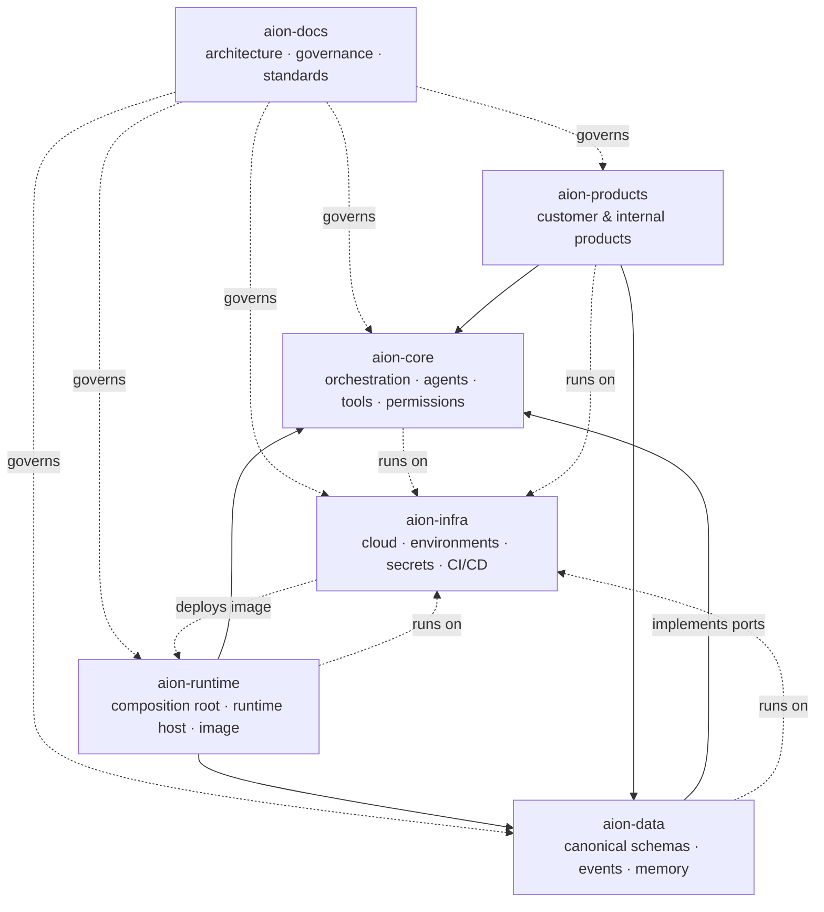

# Repository Ownership

AION is divided into six canonical repositories under the personal `Ceoloo`
account. Each has a **single, explicit responsibility**. Clear ownership is what
prevents the architectural drift that caused the [greenfield
reset](../adr/ADR-001-greenfield-reset.md). (The system began as five; the
runtime host was added as the sixth by
[ADR-002](../adr/ADR-002-runtime-host-ownership.md).)

## The six repositories

| Repository | Role | Detail |
|---|---|---|
| **aion-docs** | Architectural control plane. Contracts and architecture, not application code. | *this repo* |
| **aion-core** | Company OS primitives, orchestration, execution coordination. | [aion-core.md](aion-core.md) |
| **aion-data** | Canonical data, events, memory, learning records. | [aion-data.md](aion-data.md) |
| **aion-runtime** | Runtime host / composition root; builds the one provider-neutral image. | [aion-runtime.md](aion-runtime.md) |
| **aion-infra** | Cloud infrastructure and environments. | [aion-infra.md](aion-infra.md) |
| **aion-products** | Products built on the platform. | [aion-products.md](aion-products.md) |

### Workspace satellites

| Repository | Role | Detail |
|---|---|---|
| **aion-desks** | Desk commerce landing / Stripe checkout — product surface only ([ADR-004](../adr/ADR-004-aion-desks-repo-ownership.md)) | [aion-desks.md](aion-desks.md) |
| **aion-action-engine** | Action Queue (Signal → Action → Approval → Outcome) + the Decision Plane `@aion/decision-engine` ([ADR-009](../adr/ADR-009-decision-plane.md)) — operational module, not a control plane | [aion-action-engine.md](aion-action-engine.md) |

### Outside the canonical set (AION-Sys, unresolved)

`AION-Sys/aion-software-factory` and `AION-Sys/Ceoloo-aion-revenue-copilot`
are **actively developed** but sit in the organization
[ADR-001](../adr/ADR-001-greenfield-reset.md) declared legacy. The copilot
runs its own Supabase schema (leads, calls, outcomes) and an OpenAI-style
completion proxy — it does **not** go through the Runtime Execution Gateway
and duplicates `aion-products`' Revenue Copilot. This needs an explicit
carry-forward ADR (absorb, bridge, or retire). See
[../architecture/system-integration-overview.md](../architecture/system-integration-overview.md).

**[ADR-004 (Accepted)](../adr/ADR-004-aion-desks-repo-ownership.md):** `aion-desks`
is a **permanent product-commerce satellite** outside the six-repo platform set.
It must not own control-plane, schema, or gateway concerns.

## The rules that keep them separate

Dependency direction and boundary enforcement are defined in
[**dependency-rules.md**](dependency-rules.md). Read it before adding code to
any repository — it answers "where does this belong?"

## Principle

**Every business entity, schema, event, workflow, service, agent, product,
metric, permission, and API contract has exactly one canonical owner.** If two
repositories both seem to own something, that is a drift signal to resolve — not
a duplication to accept. See [../governance/authority-model.md](../governance/authority-model.md).
