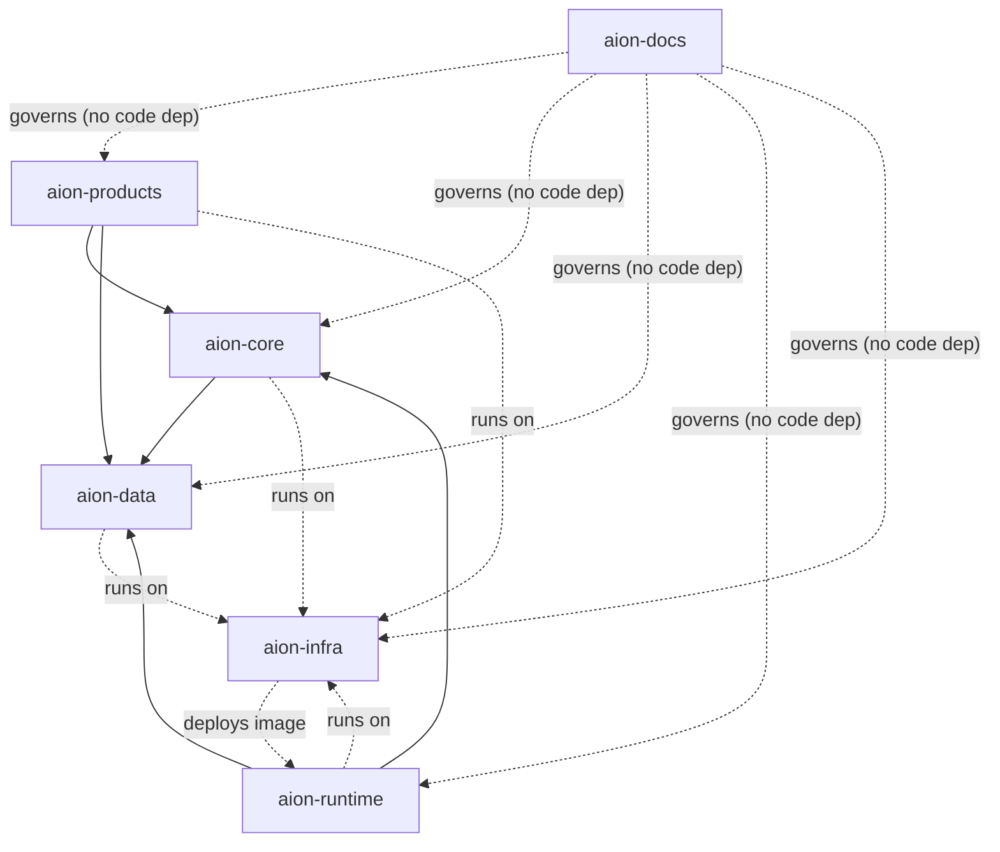

# Dependency Rules

This document answers the single most important operational question in AION:
**"where does this code belong, and what may it depend on?"** These rules exist
to prevent the drift that caused the
[greenfield reset](../adr/ADR-001-greenfield-reset.md).

## Allowed dependency direction

| From ↓ / May depend on → | docs | core | data | runtime | infra | products |
|---|---|---|---|---|---|---|
| **aion-docs** | — | no | no | no | no | no |
| **aion-core** | governed by | — | **yes** | no | runtime only | **no** |
| **aion-data** | governed by | **no** | — | no | runtime only | **no** |
| **aion-runtime** | governed by | **yes** | **yes** | — | runtime only | **no** |
| **aion-infra** | governed by | no | no | image only | — | no |
| **aion-products** | governed by | **yes** | **yes** | no | runtime only | — |

"Runtime only" means the code runs *on* infrastructure but does not import infra
as a code dependency. "Image only" means `aion-infra` builds and deploys
`aion-runtime`'s container image; it does **not** import runtime code — so no
cycle is created (see [ADR-002](../adr/ADR-002-runtime-host-ownership.md)).

## Hard rules

1. **Dependencies flow downward, never upward.** Products depend on core and
   data; core depends on data. **Core never depends on products; data never
   depends on core or products.**
2. **No cycles.** If two repositories need each other, a boundary is wrong —
   resolve it with an ADR, don't add a back-edge.
3. **aion-docs has no code dependencies and is not depended on in code.** It
   governs; it is not imported.
4. **No repository invents a canonical entity owned by another.** Canonical
   business entities live once, in `aion-data`.
5. **Products reach the platform through contracts, never around it.** No
   product bypasses the control plane to perform a governed action, and none
   forks a canonical schema.
6. **Legacy is never a dependency.** No repository imports, vendors, or depends
   on Aion-Sys. See [../legacy/README.md](../legacy/README.md).
7. **The runtime host composes; it does not redefine.** `aion-runtime` wires
   Core + Data into a running service and owns the deployable image. It must not
   hold orchestration policy, canonical schema, provider SDKs, or product logic.
   `aion-infra` consumes its **image**, never its code. See
   [ADR-002](../adr/ADR-002-runtime-host-ownership.md).

## Where does it belong? — decision aid

| If the thing is… | It belongs in… |
|---|---|
| architecture, a standard, an ADR, a template, terminology | **aion-docs** |
| a decision about *what happens / who does it / whether it's allowed* | **aion-core** |
| the canonical shape, storage, or lineage of a business entity | **aion-data** |
| where/how something runs, an environment, a secret store, CI/CD | **aion-infra** |
| the process that *boots and hosts* the platform (composition root, health, migration entrypoint, the deployable image) | **aion-runtime** |
| a customer or internal product screen/flow/experiment | **aion-products** |
| a capability reused across products and worth standardizing | **aion-core**, only under the [platformization rule](../roadmap/platform-maturity.md#platformization-rule) |

## Enforcing this

- New code that violates the direction table is a **drift defect**, addressed
  before merge.
- A capability that "sort of fits two repos" is a signal to clarify ownership
  via [../governance/authority-model.md](../governance/authority-model.md), not
  to duplicate it.
- Cross-repo contracts (events, data, APIs) are defined to the standards in
  [../engineering/](../engineering/README.md) and, when architecturally
  significant, recorded as ADRs.
