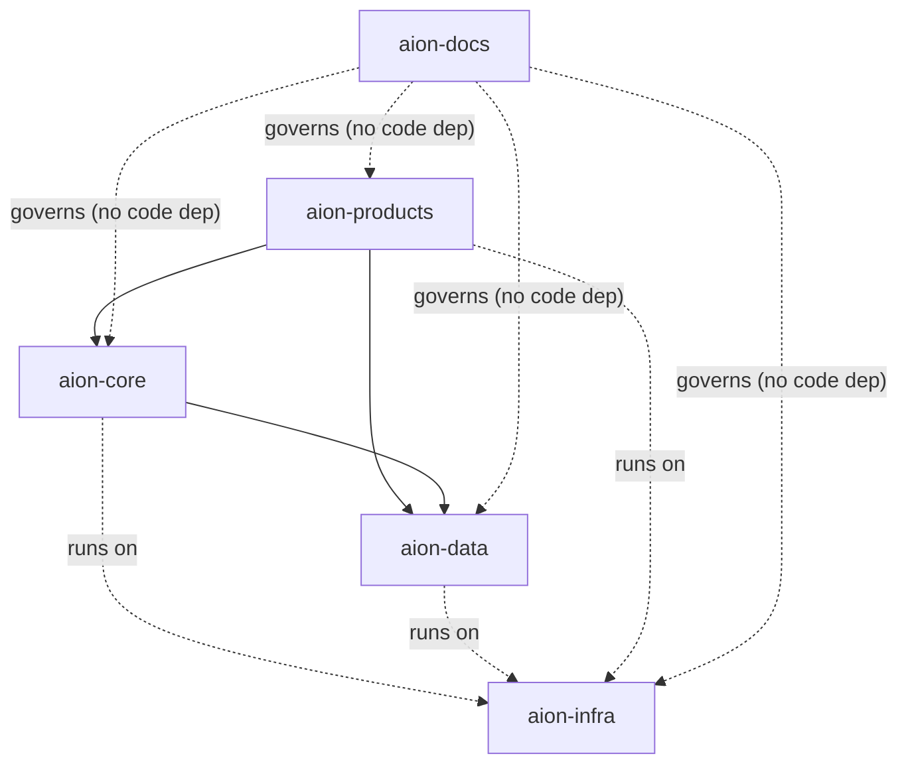

# Dependency Rules

This document answers the single most important operational question in AION:
**"where does this code belong, and what may it depend on?"** These rules exist
to prevent the drift that caused the
[greenfield reset](../adr/ADR-001-greenfield-reset.md).

## Allowed dependency direction

| From ↓ / May depend on → | docs | core | data | infra | products |
|---|---|---|---|---|---|
| **aion-docs** | — | no | no | no | no |
| **aion-core** | governed by | — | **yes** | runtime only | **no** |
| **aion-data** | governed by | **no** | — | runtime only | **no** |
| **aion-infra** | governed by | no | no | — | no |
| **aion-products** | governed by | **yes** | **yes** | runtime only | — |

"Runtime only" means the code runs *on* infrastructure but does not import infra
as a code dependency.

## Hard rules

1. **Dependencies flow downward, never upward.** Products depend on core and
   data; core depends on data. **Core never depends on products; data never
   depends on core or products.**
2. **No cycles.** If two repositories need each other, a boundary is wrong —
   resolve it with an ADR, don't add a back-edge.
3. **aion-docs has no code dependencies and is not depended on in code.** It
   governs; it is not imported.
4. **No repository invents a canonical entity owned by another.** Canonical
   business entities live once, in `aion-data`.
5. **Products reach the platform through contracts, never around it.** No
   product bypasses the control plane to perform a governed action, and none
   forks a canonical schema.
6. **Legacy is never a dependency.** No repository imports, vendors, or depends
   on Aion-Sys. See [../legacy/README.md](../legacy/README.md).

## Core depends on data contracts, not storage

The `core → data` edge is a dependency on **data contracts / ports**, not on a
concrete database or persistence implementation:

- `aion-data` owns the canonical **contracts** (schemas, events, the six data
  kinds) **and** provides the **persistence adapters** that implement them.
- `aion-core` depends only on those contracts/ports. It must not import, embed,
  or hard-code a specific storage engine, client, or query dialect.
- The storage engine itself is a **deferred, ADR-gated decision** (see
  [../architecture/data-layer.md](../architecture/data-layer.md)). Coupling the
  control plane to a chosen engine would re-introduce exactly the drift the
  [reset](../adr/ADR-001-greenfield-reset.md) removed.

This keeps the control plane clean: swap the storage implementation and `core`
is unaffected because it only ever knew the contract.

## Where does it belong? — decision aid

| If the thing is… | It belongs in… |
|---|---|
| architecture, a standard, an ADR, a template, terminology | **aion-docs** |
| a decision about *what happens / who does it / whether it's allowed* | **aion-core** |
| the canonical shape, storage, or lineage of a business entity | **aion-data** |
| where/how something runs, an environment, a secret store, CI/CD | **aion-infra** |
| a customer or internal product screen/flow/experiment | **aion-products** |
| a capability reused across products and worth standardizing | **aion-core**, only under the [platformization rule](../roadmap/platform-maturity.md#platformization-rule) |

## Enforcing this

- New code that violates the direction table is a **drift defect**, addressed
  before merge.
- A capability that "sort of fits two repos" is a signal to clarify ownership
  via [../governance/authority-model.md](../governance/authority-model.md), not
  to duplicate it.
- Cross-repo contracts (events, data, APIs) are defined to the standards in
  [../engineering/](../engineering/README.md) and, when architecturally
  significant, recorded as ADRs.
