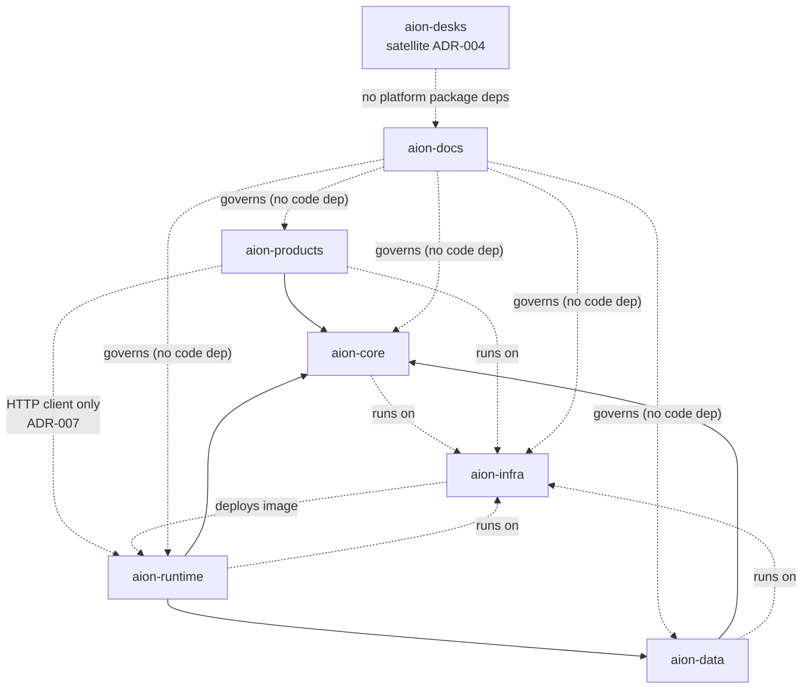

# Dependency Rules

This document answers the single most important operational question in AION:
**"where does this code belong, and what may it depend on?"** These rules exist
to prevent the drift that caused the
[greenfield reset](../adr/ADR-001-greenfield-reset.md).

> **Package direction (ADR-005):** Durable adapters live in `aion-data` and
> **depend on** `@aion/core` contracts/ports. `aion-core` stays database-agnostic
> and must **not** depend on `@aion/data`. Older diagrams that drew
> `CORE --> DATA` as a *package* edge were wrong relative to the ports pattern.

## Allowed dependency direction

| From ↓ / May depend on → | docs | core | data | runtime | infra | products | desks |
|---|---|---|---|---|---|---|---|
| **aion-docs** | — | no | no | no | no | no | no |
| **aion-core** | governed by | — | **no** | no | runtime only | **no** | no |
| **aion-data** | governed by | **yes** (contracts/ports) | — | no | runtime only | **no** | no |
| **aion-runtime** | governed by | **yes** | **yes** | — | runtime only | **no** | no |
| **aion-infra** | governed by | no | no | image only | — | no | no |
| **aion-products** | governed by | **yes** | package optional; prefer Runtime façade | **HTTP only** (no package import) | runtime only | — | no |
| **aion-desks** | governed by | **no** | **no** | **no** | runtime only | no | — |

"Runtime only" means the code runs *on* infrastructure but does not import infra
as a code dependency. "Image only" means `aion-infra` builds and deploys
`aion-runtime`'s container image; it does **not** import runtime code — so no
cycle is created (see [ADR-002](../adr/ADR-002-runtime-host-ownership.md)).

**Products → Runtime:** products must not add `@aion/runtime` as a code
dependency. Production paths call the Execution Gateway over HTTP
([ADR-007](../adr/ADR-007-products-runtime-http-client.md)).

**Products → Data:** a direct `@aion/data` package dependency remains *allowed*
for typed clients, but the preferred production path is Runtime as the durable
façade (no product-local Postgres). Mirrored DTO copies without a shared
contract package are a drift risk — see
[../engineering/contract-hygiene.md](../engineering/contract-hygiene.md).

## Hard rules

1. **Package dependencies follow the ports pattern.** `aion-data` depends on
   `aion-core` to implement ports. **`aion-core` never depends on `aion-data`,
   products, runtime, or desks.** See
   [ADR-005](../adr/ADR-005-package-dependency-direction.md).
2. **No cycles.** If two repositories need each other, a boundary is wrong —
   resolve it with an ADR, don't add a back-edge.
3. **aion-docs has no code dependencies and is not depended on in code.** It
   governs; it is not imported.
4. **No repository invents a canonical entity owned by another.** Canonical
   business entities are persisted once, in `aion-data`; their *runtime shapes*
   are owned as contracts in `aion-core` unless an ADR says otherwise.
5. **Products reach the platform through contracts, never around it.** No
   product bypasses the control plane / Runtime Gateway to perform a governed
   action, and none forks a canonical schema.
6. **Legacy is never a dependency.** No repository imports, vendors, or depends
   on Aion-Sys. See [../legacy/README.md](../legacy/README.md).
7. **The runtime host composes; it does not redefine.** `aion-runtime` wires
   Core + Data into a running service and owns the deployable image. Gateway
   HTTP is allowed ([ADR-003](../adr/ADR-003-execution-gateway-into-runtime.md));
   domain bulk and product/CRM adapters must stay within the composition-root
   budget ([ADR-008](../adr/ADR-008-runtime-composition-scope.md)).
   `aion-infra` consumes its **image**, never its code.
8. **`aion-desks` stays a commerce satellite.** No `@aion/core` / `@aion/data` /
   Runtime package imports ([ADR-004](../adr/ADR-004-aion-desks-repo-ownership.md)).

## Where does it belong? — decision aid

| If the thing is… | It belongs in… |
|---|---|
| architecture, a standard, an ADR, a template, terminology | **aion-docs** |
| a decision about *what happens / who does it / whether it's allowed* | **aion-core** |
| the canonical shape, storage, or lineage of a business entity | **aion-data** |
| where/how something runs, an environment, a secret store, CI/CD | **aion-infra** |
| the process that *boots and hosts* the platform (composition root, health, migration entrypoint, gateway ingress, the deployable image) | **aion-runtime** |
| a customer or internal product screen/flow/experiment | **aion-products** |
| Desk SKU landing / Stripe checkout only | **aion-desks** (satellite) |
| a capability reused across products and worth standardizing | **aion-core**, only under the [platformization rule](../roadmap/platform-maturity.md#platformization-rule) |

## Enforcing this

- New code that violates the direction table is a **drift defect**, addressed
  before merge.
- A capability that "sort of fits two repos" is a signal to clarify ownership
  via [../governance/authority-model.md](../governance/authority-model.md), not
  to duplicate it.
- Cross-repo contracts (events, data, APIs) are defined to the standards in
  [../engineering/](../engineering/README.md) and, when architecturally
  significant, recorded as ADRs.
- Pin `@aion/core` / `@aion/data` to **tagged releases** (not mutable tree
  overlays). See [contract-hygiene](../engineering/contract-hygiene.md).
