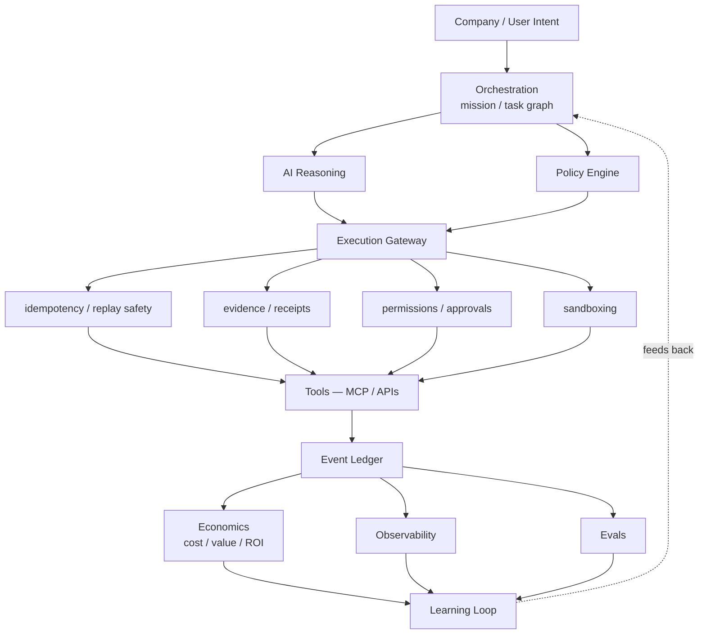

# 2026 Runtime-Control Brief

- **Date:** 2026-09-04
- **Author:** Research (Founder-directed)
- **Status:** Captured — responses recorded as ADRs, architecture, and design specs

## The signal

The frontier of agent systems in 2026 is moving away from *"smarter agents"* and
toward **better runtime control** — execution isolation, replay safety, policy
enforcement, telemetry, evals, and measurable economics. Five independent
sources point the same direction. Each is summarized below with the one thing it
changes for AION.

The strongest takeaway is not that AION must be rebuilt. It is that the industry
is **converging on the architecture AION already documented** — a governed
control plane that separates intelligence from side effects. What this brief
adds is *precision* on the parts of that doctrine that were named but not yet
specified: idempotency/replay, execution evidence, agent economics, a unified
trace schema, graduated autonomy, and A2A interoperability.

## The five signals

### 1. Replay safety and data isolation (OpenAI Agents SDK 0.22 / 0.19)

Recent Agents-SDK releases harden production behavior around resumability,
guardrails, retries, state checkpoints, and data leakage: stronger isolation of
usage snapshots across resumed runs, safer handling when output guardrails block
tool-produced content, stricter handling of failed/incomplete model responses,
safer retry semantics, and durable staged input across serialized run state.
Programmatic Tool Calling (0.19) lets a model emit a bounded program that
coordinates several tools inside a restricted sandbox — while **approvals,
guardrails, concurrency controls, tracing, and pause/resume still apply**.

- **What this validates:** the execution-gateway separation of *agent
  intelligence* from *side effects*, and the pause/resume gate AION Core already
  implements (`awaiting_approval` → `approved` resumes the **same** run).
- **What is genuinely new for AION:** **idempotency and replay protection**. A
  resumed worker — Grok, Atlas, Cursor, or a future AION worker — must never
  unknowingly execute the same external side effect twice. AION Core has no
  idempotency key and no execution receipt today.
- **Response:** [ADR-003](../adr/ADR-003-execution-gateway-and-evidence.md);
  [`architecture/execution-gateway.md`](../architecture/execution-gateway.md).

### 2. Removing model turns, not buying cheaper models (Microsoft CodeAct)

A production-oriented benchmark reports that letting an agent emit one sandboxed
program that invokes several tools — instead of a model↔tool↔model↔tool loop —
cut a representative workload from **27.81s → 13.23s (52.4% faster)** and
**6,890 → 2,489 tokens (63.9% fewer)**, with the generated code running inside a
fresh micro-VM so orchestration savings do not require unrestricted machine
access.

- **What this validates:** AION's separation of **LLM reasoning** (judgment) from
  **deterministic execution** (APIs/SQL/transforms) — see
  [execution-layer](../architecture/execution-layer.md).
- **What is genuinely new for AION:** a third workload class —
  **programmatic orchestration** (chaining many deterministic operations in one
  sandboxed plan) — and the sandbox that makes it safe.
- **Response:** [`aion-core/docs/design/programmatic-execution-and-a2a.md`],
  [`aion-infra/docs/design/programmatic-execution-sandbox.md`]. Priority **P1**:
  prototype and measure against the standard loop before committing.

### 3. Observability is expanding into Agent ROI (Microsoft Foundry)

The maturing observability model centers on **Trace → Evaluate → Monitor →
Optimize**, with OpenTelemetry-based telemetry spanning multiple agent
frameworks in one trace architecture, and — the important part — explicit
**agent ROI tracking**: operating cost vs. task completion, time saved, cost
efficiency. The stated direction is **trace → quality → cost → business value**,
not **trace → token count**.

- **What this validates:** AION's observability spine already carries
  `risk_level`, `approval_state`, `cost`, and `outcome_reference`
  ([observability](../architecture/observability.md)), and keeps *results*
  distinct from *outcomes* ([principles #6](../engineering/principles.md)).
- **What is genuinely new for AION:** (a) an explicitly **OpenTelemetry-mappable
  trace schema** so AION traces interoperate with the wider ecosystem, and (b) a
  **vendor-neutral Agent Economics layer** turning `worker_runs`-style telemetry
  into cost → completion → value → ROI.
- **Response:** [ADR-004](../adr/ADR-004-agent-economics-layer.md);
  [`architecture/agent-economics.md`](../architecture/agent-economics.md);
  [`engineering/agent-trace-schema.md`](../engineering/agent-trace-schema.md).

### 4. Policy-as-code around the reasoning loop (IBM CUGA)

A governance architecture places policy enforcement at five checkpoints —
**Intent Guard** (before planning), **Playbook** (steering reasoning), **Tool
Guide** (constraints at selection/execution), **Tool Approval** (HITL for risky
actions), **Output Formatter** (control before returning) — with the key idea
that governance must live **outside the model loop** and intercept execution
structurally, not as a prompt telling the model what not to do.

- **What this validates:** AION's central policy engine, deny-by-default
  permissions, and human gates are already *outside* the worker
  ([permissions](../governance/permissions.md),
  [human-gates](../governance/human-gates.md)). The `PolicyEngine` returns a
  structured `ALLOW / DENY / REQUIRE_APPROVAL` decision, never a prompt.
- **What is genuinely new for AION:** the checkpoint *map* is a useful audit of
  where enforcement must sit, and it motivates **graduated autonomy**
  (auto / monitor / approve / deny) rather than a binary gate.
- **Response:** [`governance/autonomy-tiers.md`](../governance/autonomy-tiers.md);
  no change to the permission/gate primitives — they already satisfy the model.

### 5. A2A is becoming a real interoperability layer

The Agent2Agent protocol has matured (150+ supporting organizations; adoption
across supply chain, financial services, insurance, IT ops). The ecosystem is
separating into two layers: **MCP** for *Agent ↔ Tools/Data* and **A2A** for
*Agent ↔ Agent*.

- **What this validates:** AION's execution layer already treats tools and
  external runtimes as interchangeable behind one contract
  ([execution-layer](../architecture/execution-layer.md)).
- **What is genuinely new for AION:** nothing to build now — but internal
  message/task schemas should be **designed to map cleanly onto A2A later**, so a
  young standard never becomes a critical dependency prematurely.
- **Response:** [`aion-core/docs/design/programmatic-execution-and-a2a.md`].
  Priority **P2** (compatibility, not adoption).

## The architecture this converges on

The moat is **not** the orchestration layer alone. It is
**permissions + execution + telemetry + evals + economics + learning** — the
governed control plane, not the agents inside it. That is precisely the AION
Agent OS definition already in the [system overview](../architecture/system-overview.md);
this brief sharpens the parts that turn it from a diagram into contracts.

## AION build order from this research

| Priority | Item | Primary repos | Response spec |
|---|---|---|---|
| **P0** | Execution Gateway — capability permissions, risk, **idempotency, replay protection, execution receipts** | core, data, runtime | ADR-003; core & data design specs |
| **P0** | Unified Agent Trace Schema — OpenTelemetry-compatible | docs, infra | [agent-trace-schema](../engineering/agent-trace-schema.md); infra pipeline spec |
| **P0** | Agent Economics — cost → completion → value → ROI | data, core, products | ADR-004; [agent-economics](../architecture/agent-economics.md) |
| **P1** | Programmatic Execution (CodeAct/PTC), measured | core, infra | core & infra design specs |
| **P1** | Risk-based graduated autonomy (auto/monitor/approve/deny) | docs, core | [autonomy-tiers](../governance/autonomy-tiers.md) |
| **P2** | A2A compatibility (map internal contracts, don't adopt yet) | core | core design spec |

## Signal → response map

| Signal | New for AION? | Response |
|---|---|---|
| Replay safety / data isolation | **Yes** — idempotency & receipts | ADR-003, execution-gateway |
| CodeAct token/latency wins | **Yes** — programmatic workload class | core & infra programmatic specs (P1) |
| Foundry ROI observability | **Partly** — OTel mapping + economics | ADR-004, agent-economics, agent-trace-schema |
| IBM policy-as-code checkpoints | **No** (validated) + graduated autonomy | autonomy-tiers |
| A2A interoperability | **Later** — design for mapping | core programmatic/A2A spec (P2) |

## Non-goals of this brief

- It does not authorize building any P0–P2 subsystem before a mission requires
  it. It authorizes **design specs**.
- It does not select a vendor for any deferred technology (sandbox engine, OTel
  backend, event bus). Those remain ADR-gated at the point of need.
- It does not rebuild AION around A2A or any single external SDK.
