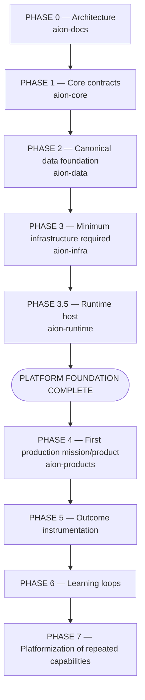

# Build Order

AION is assembled in phases. The order is deliberate: **architecture before
contracts, contracts before data, data before infrastructure, and infrastructure
before products** — with instrumentation and learning layered on once there is
something real to instrument and learn from.

| Phase | Focus | Repo(s) |
|---|---|---|
| **0** | Architecture & governance — the constitution. | aion-docs |
| **1** | Core contracts — orchestration, execution, agent/tool interfaces, permissions. | aion-core |
| **2** | Canonical data foundation — schemas, events, the six data kinds. | aion-data |
| **3** | Minimum infrastructure required — only what current missions need. | aion-infra |
| **3.5** | Runtime host — the composition root that boots Core+Data and builds the one provider-neutral image. Closes the platform boundary before any product attaches. See [ADR-002](../adr/ADR-002-runtime-host-ownership.md). | aion-runtime |
| **4** | First production mission/product. | aion-products |
| **5** | Outcome instrumentation — record real outcomes. | aion-data + aion-core |
| **6** | Learning loops — turn outcomes into lessons and memory. | aion-data + aion-core |
| **7** | Platformization — promote repeated capabilities, under the rule. | aion-core |

**Phase 3.5 (Runtime host)** is deliberately small: it is not a new subsystem
but the extraction of the Phase 3 reference host into its own repository so the
dependency rules hold cleanly (infra must not import core/data). With it in
place, **Docs → Core → Data → Infra → Runtime** constitute the completed
platform foundation; Phase 4 (the first product) may then attach. Standing up
the first real production deployment is an **operational activation milestone**,
not another architecture phase.

## The critical caveat

**A phase does NOT mean every imagined subsystem gets implemented during it.**
Each phase implements **only what is required to support current missions**
([Mission Before Infrastructure](../engineering/principles.md)).

- Phase 1 does not build the entire Company OS — it builds the contracts the
  first mission needs.
- Phase 2 does not model every business entity — it models the entities the
  first mission needs.
- Phase 3 builds the **minimum** infrastructure, not a speculative platform.
- Phases 5–7 begin only once there is real product activity producing outcomes
  worth instrumenting and learning from.

## Why this order

- **Docs first** so that where code belongs is decided before code exists — the
  direct counter to the [reset](../adr/ADR-001-greenfield-reset.md).
- **Core contracts before data implementation** so data serves defined
  execution needs, not the reverse.
- **Data before infra** so infrastructure is provisioned against real data needs,
  not guessed ones.
- **A real product before instrumentation** so outcomes and learning have
  something true to measure.

## Current position

Phases 0–3 are complete: `aion-docs` (architecture), `aion-core` (Phase 1),
`aion-data` (Phase 2), and `aion-infra` (Phase 3, provider-portable). The
current build is **Phase 3.5 — `aion-runtime`**: extracting the runtime host
into its own repository ([ADR-002](../adr/ADR-002-runtime-host-ownership.md)) to
close the platform boundary. When it lands, **Docs → Core → Data → Infra →
Runtime** is the completed foundation and **Phase 4** (the first product) may
begin; the first real production deployment is an operational activation
milestone run in parallel, not a further architecture phase.

## Invariants

- **Phases are sequenced, but scope within a phase is mission-bounded.**
- **No speculative subsystems.**
- **Instrumentation and learning follow real product activity.**
