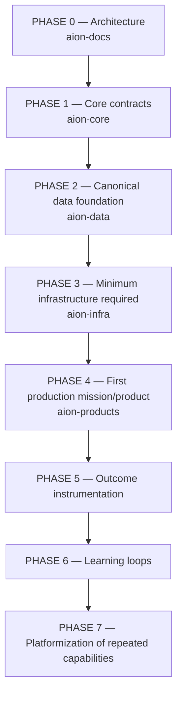

# Build Order

AION is assembled in phases. The order is deliberate: **architecture before
contracts, contracts before data, data before infrastructure, and infrastructure
before products** — with instrumentation and learning layered on once there is
something real to instrument and learn from.

| Phase | Focus | Repo(s) |
|---|---|---|
| **0** | Architecture & governance — the constitution. **(COMPLETE)** | aion-docs |
| **1** | Core contracts — orchestration, execution, agent/tool interfaces, permissions. **(AUTHORIZED — current)** | aion-core |
| **2** | Canonical data foundation — schemas, events, the six data kinds. | aion-data |
| **3** | Minimum infrastructure required — only what current missions need. | aion-infra |
| **4** | First production mission/product. | aion-products |
| **5** | Outcome instrumentation — record real outcomes. | aion-data + aion-core |
| **6** | Learning loops — turn outcomes into lessons and memory. | aion-data + aion-core |
| **7** | Platformization — promote repeated capabilities, under the rule. | aion-core |

## The critical caveat

**A phase does NOT mean every imagined subsystem gets implemented during it.**
Each phase implements **only what is required to support current missions**
([Mission Before Infrastructure](../engineering/principles.md)).

- Phase 1 does not build the entire Company OS — it builds the contracts the
  first mission needs.
- Phase 2 does not model every business entity — it models the entities the
  first mission needs.
- Phase 3 builds the **minimum** infrastructure, not a speculative platform.
- Phases 5–7 begin only once there is real product activity producing outcomes
  worth instrumenting and learning from.

## Why this order

- **Docs first** so that where code belongs is decided before code exists — the
  direct counter to the [reset](../adr/ADR-001-greenfield-reset.md).
- **Core contracts before data implementation** so data serves defined
  execution needs, not the reverse.
- **Data before infra** so infrastructure is provisioned against real data needs,
  not guessed ones.
- **A real product before instrumentation** so outcomes and learning have
  something true to measure.

## Current position

**Phase 0 is COMPLETE.** `aion-docs` is established as the architectural control
plane: the architecture, boundaries, governance, standards, mission lifecycle,
ADR system, and roadmap exist and are internally consistent. This is sufficient
for another engineering agent to understand what AION is, how it is divided,
where new code belongs, how missions move, what agents may do, how decisions are
made, and what to build next.

**Phase 1 is AUTHORIZED.** Implementation of `aion-core` may now begin, bounded
by the [critical caveat](#the-critical-caveat) (mission-scoped, not the whole
Company OS) and closed by the **Phase 1 exit gate** below.

> Phases 2–7 remain **not authorized**. Do not begin `aion-data`, `aion-infra`,
> or `aion-products` until their predecessor phase's exit gate is met.

## Phase 1 exit gate — `aion-core`

Phase 1 is complete when `aion-core` provides **stable, versioned contracts**
for each of the following, and **tests prove those contracts can support one
real mission end-to-end without requiring product-specific logic in core.**

| Contract | Purpose | Reference |
|---|---|---|
| **Mission** | The unit of work AION builds toward. | [../missions/lifecycle.md](../missions/lifecycle.md) |
| **Actor / Agent** | A governed worker or actor identity + its specification. | [../governance/agent-governance.md](../governance/agent-governance.md) |
| **Capability** | A named thing the system can do, independent of runtime. | [../architecture/execution-layer.md](../architecture/execution-layer.md) |
| **Tool** | An invocable capability with an explicit interface. | [../architecture/execution-layer.md](../architecture/execution-layer.md) |
| **Workflow / Run** | A unit of dispatched work and its identity (`run_id`, `mission_id`, `workflow_id`). | [../architecture/control-plane.md](../architecture/control-plane.md) |
| **Command** | An instruction/intention (distinct from an event). | [../engineering/event-standards.md](../engineering/event-standards.md) |
| **Event** | A past-tense, completed fact. | [../engineering/event-standards.md](../engineering/event-standards.md) |
| **Policy / Permission** | Least-privilege allow/deny + policy evaluation. | [../governance/permissions.md](../governance/permissions.md) |
| **Approval Gate** | A fail-safe human-approval checkpoint. | [../governance/human-gates.md](../governance/human-gates.md) |
| **Result / Outcome reference** | A pointer from an action to its recorded outcome. | [../architecture/learning-loop.md](../architecture/learning-loop.md) |
| **Execution telemetry** | The observability spine emitted by every significant action. | [../engineering/observability-standards.md](../engineering/observability-standards.md) |

**Gate conditions:**

1. **Contracts are stable and versioned** — each is explicit, owned, and
   backward-compatible-by-default per [API](../engineering/api-standards.md),
   [event](../engineering/event-standards.md), and
   [data-contract](../engineering/data-contracts.md) standards.
2. **Command ≠ Event is enforced in the type system**, not merely by convention.
3. **One real mission runs end-to-end through these contracts** — dispatched,
   permission-checked, gated where required, executed via the common execution
   contract, with outcome and telemetry recorded — **with zero product-specific
   logic living in `aion-core`.**
4. **Tests prove it** to the [testing standard](../engineering/testing.md), and
   the mission itself meets its [release gate](../missions/release-template.md).

Meeting this gate authorizes **Phase 2** (`aion-data`). Not before.

### Design constraint carried into Phase 1: depend on ports, not storage

`aion-core` depends on **data contracts / ports**, never on a concrete database
or persistence implementation. `aion-data` supplies the persistence adapters
behind those ports. This keeps the control plane decoupled from whatever storage
is later chosen (a deferred, ADR-gated decision) and preserves the clean
`core → data` direction as a dependency on *contracts*, not on a vendor. See
[../repositories/dependency-rules.md](../repositories/dependency-rules.md).

## Invariants

- **Phases are sequenced, but scope within a phase is mission-bounded.**
- **No speculative subsystems.**
- **Instrumentation and learning follow real product activity.**
