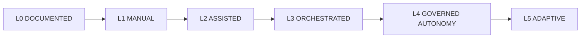
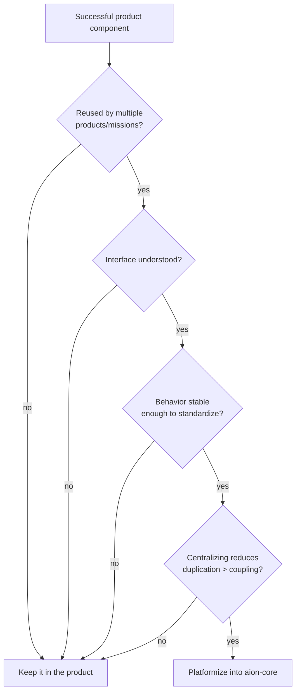

# Platform Maturity

Maturity measures how much of AION runs autonomously **and how well it learns** —
not how little humans are involved. **Maximum autonomy is not the goal.** The
goal is **reliable business outcomes with appropriate governance.**

## The maturity stages

| Stage | Meaning |
|---|---|
| **L0 — Documented** | Architecture and contracts exist. *(AION is here.)* |
| **L1 — Manual** | Humans perform most execution using documented workflows. |
| **L2 — Assisted** | AI copilots provide intelligence and recommendations; humans still act. |
| **L3 — Orchestrated** | AION routes work across tools and agents; execution is coordinated. |
| **L4 — Governed Autonomy** | **Low-risk** workflows execute autonomously **within policy**; high-risk stays gated. |
| **L5 — Adaptive** | Outcome-driven learning improves workflows and recommendations over time. |

## Reading the model correctly

- **L5 is not "no humans."** It is a system whose *learning* is mature enough to
  improve itself from real outcomes — with human authority and gates intact.
- **Maturity is per-workflow, not global.** A single workflow may be at L4 while
  most of the system is at L2. There is no single system-wide level once real
  work begins.
- **Autonomy is earned by outcomes.** A workflow moves toward L4 only after
  validated outcomes ([evals](../engineering/evals.md),
  [learning loop](../architecture/learning-loop.md)) justify removing a
  low-risk gate.
- **High-risk actions never lose their gates**, at any maturity. See
  [../governance/risk-levels.md](../governance/risk-levels.md) and
  [../governance/human-gates.md](../governance/human-gates.md).

---

## Platformization Rule

Maturity includes deciding when a capability becomes a **shared platform
primitive** in `aion-core`. **Do not turn every successful product component
into `aion-core`.**

A component becomes a shared platform primitive **only when all four hold:**

1. **it is reused by multiple products or missions;**
2. **its interface is understood;**
3. **its behavior is stable enough to standardize;**
4. **centralizing it reduces duplication more than it creates coupling.**

Premature platformization creates the coupling and false-generalization that the
[reset](../adr/ADR-001-greenfield-reset.md) was meant to escape. When in doubt,
**keep it in the product** until all four conditions are clearly met. A
platformization decision is architecturally significant — record it as an
[ADR](../adr/README.md).

## Invariants

- **Reliable outcomes with governance > maximum autonomy.**
- **Autonomy is earned per workflow, from validated outcomes.**
- **High-risk gates persist at every maturity level.**
- **Platformize only when all four conditions hold.**
